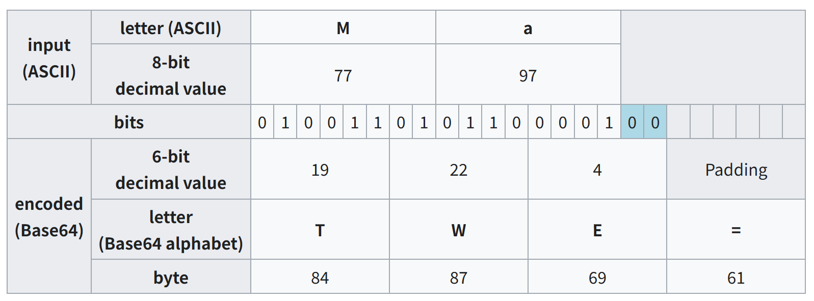
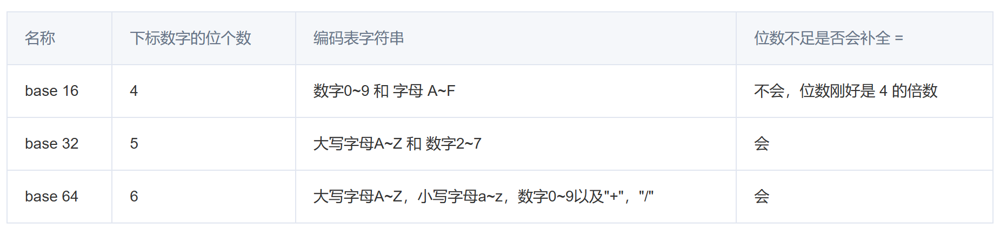
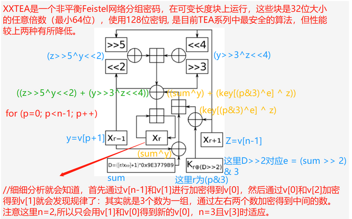

> IDA分析pseudocode时，往往会发现存在加密算法，本篇将介绍几种常见的几种，基础的加密算法要求了解具体原理，因为可以魔改

---

<!-- more -->

## base64

将字符从8bit表示转换为6bit表示，映射到给定的**字符表**（可换），padding为 **"="**

特征：编码后长度是4的倍数，以及末尾的"="



前面提到了字符表可换，实际上大部分用到base64的题目都需要换表，以下是b64换表dec

```python
import base64
import string

#cipher
str1 = ""

#string1为替换表，string2为标准表
string1 = ""
string2 = "ABCDEFGHIJKLMNOPQRSTUVWXYZabcdefghijklmnopqrstuvwxyz0123456789+/"

print (base64.b64decode(str1.translate(str.maketrans(string1,string2))))
```

同理，还有base16，base32，事实上base后面的数字就代表了bit表示的数据量，如5bit为$2^{5}=32$ ，6bit为$2^{6}=64$ 



[EasyUPX](https://c0d4.ink/2025/11/06/EasyUPX/)

---

## MD5

> **MD5消息摘要算法**（MD5 Message-Digest Algorithm），一种被广泛使用的[密码散列函数](https://zh.wikipedia.org/wiki/%E5%AF%86%E7%A2%BC%E9%9B%9C%E6%B9%8A%E5%87%BD%E6%95%B8)，可以产生出一个128位16字节的散列值（hash value），用于确保信息传输完整一致。

16bit/32bit Encryption

```python
import hashlib

def md5_encrypt(text: str, length: int = 32) -> str:
    md5_value = hashlib.md5(text.encode()).hexdigest()  # 32位小写
    if length == 16:  # 取中间16位，也可能是lowercase/uppercase，自行改索引即可
        return md5_value[8:24]
    return md5_value

#cipher
s = ""
print("MD5(32位):", md5_encrypt(s, 32))
print("MD5(16位):", md5_encrypt(s, 16))
```

MD5 是**不可逆加密（哈希）算法**，不存在通用的数学解密方式。

[Z333333](https://c0d4.ink/2025/11/06/Z333333/)

---

## TEA

> Tiny Encryption Algorithm， 微型加密算法

### Basic-TEA

标准TEA，

```c
void encrypt(uint32_t* v, uint32_t* k) {
    uint32_t v0=v[0], v1=v[1], sum=0;
    uint32_t delta=0x9e3779b9;
    uint32_t k0=k[0], k1=k[1], k2=k[2], k3=k[3];
    for (uint32_t i = 0; i < 32; i++) {
        sum += delta;
        v0 += ((v1<<4) + k0) ^ (v1 + sum) ^ ((v1>>5) + k1);
        v1 += ((v0<<4) + k2) ^ (v0 + sum) ^ ((v0>>5) + k3);
    }
    v[0]=v0; v[1]=v1;
}

void decrypt(uint32_t* v, uint32_t* k) {
    uint32_t v0=v[0], v1=v[1], sum=0xC6EF3720;
    uint32_t delta=0x9e3779b9;
    uint32_t k0=k[0], k1=k[1], k2=k[2], k3=k[3];
    for (uint32_t i = 0; i < 32; i++) {
        v1 -= ((v0<<4) + k2) ^ (v0 + sum) ^ ((v0>>5) + k3);
        v0 -= ((v1<<4) + k0) ^ (v1 + sum) ^ ((v1>>5) + k1);
        sum -= delta;
    }
    v[0]=v0; v[1]=v1;
}
```

特征：**魔数**(image number)，即delta，一般为**0x9E3779B9 (-)**, 减法时为 **0x61C88647(+)**

> 0x9E3779B9 = - 0x61C88647, 黄金分割比


[simple tea](https://c0d4.ink/2025/11/07/simple-tea/)

---

### XTEA

> xtea is similar to tea

密钥变为根据sum值的轮换使用，`&3` 保证了k的索引在0~3

同时v0,v1的轮换，异或，加法也有调整

```c
void encrypt(uint32_t* v, uint32_t* k) {
    uint32_t v0=v[0], v1=v[1], sum=0, delta=0x9E3779B9;
    for (uint32_t i = 0; i < 32; i++) {
        v0 += (((v1<<4) ^ (v1>>5)) + v1) ^ (sum + k[sum & 3]);
        sum += delta;
        v1 += (((v0<<4) ^ (v0>>5)) + v0) ^ (sum + k[(sum>>11) & 3]);
    }
    v[0]=v0; v[1]=v1;
}

void decrypt(uint32_t* v, uint32_t* k) {
    uint32_t v0=v[0], v1=v[1], delta=0x9E3779B9, sum=0xC6EF3720;
    for (uint32_t i=0; i<32; i++) {
        v1 -= (((v0<<4) ^ (v0>>5)) + v0) ^ (sum + k[(sum>>11) & 3]);
        sum -= delta;
        v0 -= (((v1<<4) ^ (v1>>5)) + v1) ^ (sum + k[sum & 3]);
    }
    v[0]=v0; v[1]=v1;
}
```

[Easyxtea](https://c0d4.ink/2025/11/07/Easyxtea/)

---

### XXTEA

xxtea is complicated

```c
void encrypt(uint32_t* v, uint32_t* k) {
    uint32_t v0=v[0], v1=v[1], sum=0, delta=0x9E3779B9;
    for (uint32_t i = 0; i < 32; i++) {
        sum += delta;
        uint32_t e = (sum >> 2) & 3;
        v0 += (((v1 << 4) ^ (v1 >> 5)) + (v1 ^ sum)) ^ (k[(0 & 3) ^ e] ^ v1);
        v1 += (((v0 << 4) ^ (v0 >> 5)) + (v0 ^ sum)) ^ (k[(1 & 3) ^ e] ^ v0);
    }
    v[0] = v0; v[1] = v1;
}

void decrypt(uint32_t* v, uint32_t* k) {
    uint32_t v0=v[0], v1=v[1], delta=0x9E3779B9, sum=0xC6EF3720;
    for (uint32_t i = 0; i < 32; i++) {
        uint32_t e = (sum >> 2) & 3;
        v1 -= (((v0 << 4) ^ (v0 >> 5)) + (v0 ^ sum)) ^ (k[(1 & 3) ^ e] ^ v0);
        v0 -= (((v1 << 4) ^ (v1 >> 5)) + (v1 ^ sum)) ^ (k[(0 & 3) ^ e] ^ v1);
        sum -= delta;
    }
    v[0] = v0; v[1] = v1;
}
```



[Hardxxtea]()

---

## RC4

[EasyUPX+]()

---

## AES

[AES]()
