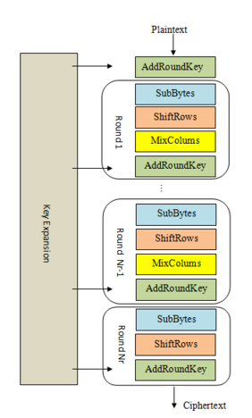
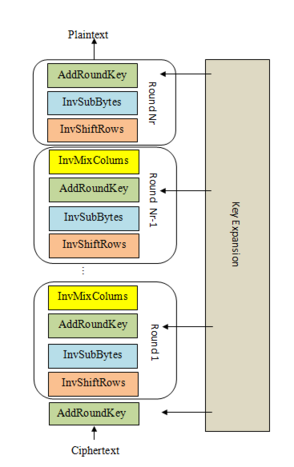

updating

<!-- more -->

## Introduction to Cryptohack

```python
_byte = chr(_integer)
_integer = ord(_byte)
# byte <=> acsii
```

```python
_bytes = bytes.fromhex(_str)
_str = _bytes.hex()
# bytes <=> hex
```

```python
_bytes = _str.encode("utf-8")
# str to bytes
```

```python
import base64

_bytes = base64.b64encode(_bytes)
_bytes = base64.b64decode(_bytes)
# base64

custom_table = ""
std_table = "ABCDEFGHIJKLMNOPQRSTUVWXYZabcdefghijklmnopqrstuvwxyz0123456789+/"
_bytes = base64.b64decode(_bytes.translate(str.maketrans(custom_table, std_table)))
# hacked_base64
```

```python
from Crypto.Util.number import *

_integer = bytes_to_long(_bytes)
_bytes = long_to_bytes(_integer)
# integer <=> bytes
```

```python
_bytes = bytes(_integers)
# integers to btyes
```

```python
from pwn import xor

_bytes = xor(A, B, [length])
# xor
# 自动匹配长度(扩展至length)
# 多类型支持(bytes/str/integer)
```

> https://cryptohack.org/courses/intro/xorkey1/

根据提示，为已知明文攻击

由$plain \oplus key = cipher$

得$key = plain \oplus cipher$

根据泄露出来的`b'crypto{'`和密文

推出key前7位为`myXORke`

猜测完整key为`myXORkey`

```python
from Crypto.Util.number import *
from pwn import xor

hex = 0x0e0b213f26041e480b26217f27342e175d0e070a3c5b103e2526217f27342e175d0e077e263451150104
b = long_to_bytes(hex)

key = b'myXORkey'

print(xor(b,key))

# crypto{1f_y0u_Kn0w_En0uGH_y0u_Kn0w_1t_4ll}
```

## Modular Arithmetic

---

**Extended Euclidean Algorithm**

**证明**

由于 $0 \le r_{i+1} < |r_i|$，$r_i$ 序列是一个递减序列，所以本算法可以在有限步内终止。又因为 $r_{i+1} = r_{i-1} - r_i q_i$，$(r_{i-1}, r_i)$ 和 $(r_i, r_{i+1})$ 的最大公约数是一样的，所以最终得到的 $r_k$ 是 $a, b$ 的最大公约数。

在欧几里得算法正确性的基础上，又对于 $a=r_0$ 和 $b=r_1$ 有等式 $as_i + bt_i = r_i$ 成立（$i = 0$ 或 $1$）。这一关系由下列递推式对所有 $i > 1$ 成立：

$r_{i+1} = r_{i-1} - r_i q_i = (as_{i-1}+bt_{i-1}) - (as_i+bt_i)q_i = (as_{i-1}-as_iq_i) + (bt_{i-1}-bt_iq_i) = as_{i+1}+bt_{i+1}$

因此 $s_i$ 和 $t_i$ 满足裴蜀等式($sa+tb=gcd$)，这就证明了扩展欧几里得算法的正确性。

**Implementation**

```python
def ext_gcd(a,b):
    prev_s,s = 1,0
    prev_t,t = 0,1
    prev_r,r = a,b
    if b == 0:
        return 1,0,a
    while(r):
        q = prev_r//r
        prev_r, r = r, prev_r - q*r
        prev_s, s = s, prev_s - q*s
        prev_t, t = t, prev_t - q*t
    return prev_s,prev_t,prev_r
# 递推

def ext_gcd(a, b):
    if b == 0:
        return a, 1, 0
    else:
        gcd, x, y = ext_gcd(b, a % b)
        return gcd, y, x - (a // b) * y
# 递归
```

---

**Fermat's little theorem**

若p为质数，有

$a^p \equiv a \pmod{p}$

若同时p不整除a，有

$a^{p-1} \equiv 1 \pmod{p}$

---

**quadratic residue**

若在 $\mathbb{F}_p$ 中，有

$r^2 = a$

则称 $a$ 为 quadratic residue

$\pm r$ 则为 $a$ 的两个根

Legendre's Symbol:

判定条件（Euler's Criterion）：

$\left(\frac{a}{p}\right) = \begin{cases} 0 & \text{if } a \equiv 0 \pmod{p} \\ +1 & \text{if } a \not\equiv 0 \pmod{p}, \text{quadratic residue} \\ -1 & \text{quadratic non-residue}\end{cases}$

> **Legendre's Symbol**
> 
> $\left( \frac{a}{p} \right) \equiv a^{ \frac{p-1}{2} } \pmod{p}$  , $\left( \frac{a}{p} \right) \in \left\{1,0,-1\right\}$
> 
> 该符号具有积性，即
> 
> $\left( \frac{mn}{p} \right) \equiv  \left( \frac{m}{p} \right)·\left( \frac{n}{p} \right) \pmod{p}$

```python
pow(a, (p-1)//2, p) == 1
```

> 大于 2 的质数 mod 4 一共只有 1 和 3 两种情况：
> 
> $p \equiv 1 \pmod{4}$ 对应 $\frac{p-1}{2}$ 为偶数，
> 
> $p \equiv 3 \pmod{4}$ 对应 $\frac{p-1}{2}$ 为奇数

当 $p \equiv 3 \pmod{4}$ 时，可以通过如下公式快速算出root

```python
root = pow(a, (p+1)//4, p)
```

**证明**

If $p \equiv 3 \pmod 4$ then $p + 1$ is divisible by 4. If we want to take the square root of $a \pmod p$ then:

$$
(\pm a^{\frac{p+1}{4}})^2 \equiv a^{\frac{p+1}{2}} \equiv a^{\frac{p-1+2}{2}} \equiv a^{\frac{p-1}{2} + 1} \equiv a^{\frac{p-1}{2}} \cdot a \pmod p
$$

But since $a$ was chosen to be a quadratic residue (otherwise it has no square roots) it follows that:

$$
a^{\frac{p-1}{2}} \equiv 1 \pmod p
$$

And hence the two square roots of $a$ modulo $p$ can in this case be very easily computed as:

$$
\pm a^{\frac{p+1}{4}}
$$

> https://cryptohack.org/courses/modular/root1/

```python
with open("output.txt",'r') as f:
    exec(f.read())

for a in ints:
    if pow(a, (p-1)//2, p) == 1:
        r = pow(a, (p+1)//4, p)
        flag = max(r,(r*(-1)%p))
print(flag)
```

而 $p \equiv 1 \pmod{4}$ 则复杂一些，通过Tonelli-Shanks解决

```python
def tonelli_shanks(n, p):
    q, s = p - 1, 0
    while q % 2 == 0:
        q //= 2
        s += 1
    z = 2
    while pow(z, (p - 1) // 2, p) != p - 1:
        z += 1
    c = pow(z, q, p)
    t = pow(n, q, p)
    r = pow(n, (q + 1) // 2, p)
    m = s
    while t != 1:
        temp = t
        i = 0
        for i in range(1, m):
            temp = pow(temp, 2, p)
            if temp == 1:
                break
        b = pow(c, 2**(m - i - 1), p)
        m = i
        c = pow(b, 2, p)
        t = (t * c) % p
        r = (r * b) % p
    return r
```

---

Chinese Remainder Theorem

---

> [Adrien's Signs](https://cryptohack.org/courses/modular/adrien/)

根据 a , p 可以算出 $\left( \frac{a}{p} \right) \equiv 1 \pmod{p}$

则 a 为模 p 的二次剩余

根据legendre's symbol的积性，有

$\left( \frac{a^e}{p} \right) = \left( \frac{a}{p} \right)^e = (1)^e = 1$

这意味着对 $\forall e$ , 皆有 $a^e$ 为二次剩余

也就是说 $e$ 的取值不影响 $a^e$ 的legendre's symbol

又根据欧拉准则的第一补充：

$p \equiv 3 \pmod{4}$ 时，有 $\left( \frac{-1}{p} \right) = -1$

就可以完成bit与legendre's symbol的对应

```python
from Crypto.Util.number import *

with open('output.txt','r') as f:
    exec(f.read())

p = 1007621497415251
plain = ''

for c in cipher: # we name the list in output.txt 'cipher'
    if pow(c, (p-1)//2 ,p) == 1:
        plain += '1'
    else:
        plain += '0'

plain = long_to_bytes(int(plain,2))
print(plain)

# crypto{p4tterns_1n_re5idu3s}
```

---

> [Modular Binomials](https://cryptohack.org/courses/modular/bionomials/)

利用二项式展开在模意义下的性质

$$
(a+b)^n = a^n + a^{n-1}b^1 + \cdots + a^1b^{n-1} + b^n \equiv a^n+b^n \pmod{ab}
$$

化简原式，再齐次化消掉 p ，获得只含 q 的表达式 X ，利用

$$
q = gcd(X,N)
$$

计算出q

```python
with open('data.txt','r') as f:
    exec(f.read())

from math import gcd

exp = e1*e2
X = (pow(5,exp,N)*pow(c1,e2,N)-pow(2,exp,N)*pow(c2,e1,N))%N
q = gcd(X,N)
p = N//q
print('crypto{'+f'{p},{q}'+'}')
```

## Symmetric Cryptography

---

**AES**

- Key Expansion (expand key to round_keys)

- Add Round Key (add round_keys into the process through XOR)

- Confusion (make it non-linear)
  
  + Sub Bytes (substitution the bytes through S-box)

- Diffusion (spread the confusion)
  
  + Shift Rows
  
  + Mix Columns (matrix multiplication on $GF(2^8)$ field)




> [Bringing It All Together](https://cryptohack.org/courses/symmetric/aes6/)

```python
def bytes2matrix(s):
  return [list(s[i:i+4]) for i in range(0, len(s), 4)]

# AddRoundKey
def add_round_key(s,k):
    for i in range(4):
        for j in range(4):
            s[i][j] ^= k[i][j]

# SubBytes

s_box = (
    0x63, 0x7C, 0x77, 0x7B, 0xF2, 0x6B, 0x6F, 0xC5, 0x30, 0x01, 0x67, 0x2B, 0xFE, 0xD7, 0xAB, 0x76,
    0xCA, 0x82, 0xC9, 0x7D, 0xFA, 0x59, 0x47, 0xF0, 0xAD, 0xD4, 0xA2, 0xAF, 0x9C, 0xA4, 0x72, 0xC0,
    0xB7, 0xFD, 0x93, 0x26, 0x36, 0x3F, 0xF7, 0xCC, 0x34, 0xA5, 0xE5, 0xF1, 0x71, 0xD8, 0x31, 0x15,
    0x04, 0xC7, 0x23, 0xC3, 0x18, 0x96, 0x05, 0x9A, 0x07, 0x12, 0x80, 0xE2, 0xEB, 0x27, 0xB2, 0x75,
    0x09, 0x83, 0x2C, 0x1A, 0x1B, 0x6E, 0x5A, 0xA0, 0x52, 0x3B, 0xD6, 0xB3, 0x29, 0xE3, 0x2F, 0x84,
    0x53, 0xD1, 0x00, 0xED, 0x20, 0xFC, 0xB1, 0x5B, 0x6A, 0xCB, 0xBE, 0x39, 0x4A, 0x4C, 0x58, 0xCF,
    0xD0, 0xEF, 0xAA, 0xFB, 0x43, 0x4D, 0x33, 0x85, 0x45, 0xF9, 0x02, 0x7F, 0x50, 0x3C, 0x9F, 0xA8,
    0x51, 0xA3, 0x40, 0x8F, 0x92, 0x9D, 0x38, 0xF5, 0xBC, 0xB6, 0xDA, 0x21, 0x10, 0xFF, 0xF3, 0xD2,
    0xCD, 0x0C, 0x13, 0xEC, 0x5F, 0x97, 0x44, 0x17, 0xC4, 0xA7, 0x7E, 0x3D, 0x64, 0x5D, 0x19, 0x73,
    0x60, 0x81, 0x4F, 0xDC, 0x22, 0x2A, 0x90, 0x88, 0x46, 0xEE, 0xB8, 0x14, 0xDE, 0x5E, 0x0B, 0xDB,
    0xE0, 0x32, 0x3A, 0x0A, 0x49, 0x06, 0x24, 0x5C, 0xC2, 0xD3, 0xAC, 0x62, 0x91, 0x95, 0xE4, 0x79,
    0xE7, 0xC8, 0x37, 0x6D, 0x8D, 0xD5, 0x4E, 0xA9, 0x6C, 0x56, 0xF4, 0xEA, 0x65, 0x7A, 0xAE, 0x08,
    0xBA, 0x78, 0x25, 0x2E, 0x1C, 0xA6, 0xB4, 0xC6, 0xE8, 0xDD, 0x74, 0x1F, 0x4B, 0xBD, 0x8B, 0x8A,
    0x70, 0x3E, 0xB5, 0x66, 0x48, 0x03, 0xF6, 0x0E, 0x61, 0x35, 0x57, 0xB9, 0x86, 0xC1, 0x1D, 0x9E,
    0xE1, 0xF8, 0x98, 0x11, 0x69, 0xD9, 0x8E, 0x94, 0x9B, 0x1E, 0x87, 0xE9, 0xCE, 0x55, 0x28, 0xDF,
    0x8C, 0xA1, 0x89, 0x0D, 0xBF, 0xE6, 0x42, 0x68, 0x41, 0x99, 0x2D, 0x0F, 0xB0, 0x54, 0xBB, 0x16,
)

inv_s_box = (
    0x52, 0x09, 0x6A, 0xD5, 0x30, 0x36, 0xA5, 0x38, 0xBF, 0x40, 0xA3, 0x9E, 0x81, 0xF3, 0xD7, 0xFB,
    0x7C, 0xE3, 0x39, 0x82, 0x9B, 0x2F, 0xFF, 0x87, 0x34, 0x8E, 0x43, 0x44, 0xC4, 0xDE, 0xE9, 0xCB,
    0x54, 0x7B, 0x94, 0x32, 0xA6, 0xC2, 0x23, 0x3D, 0xEE, 0x4C, 0x95, 0x0B, 0x42, 0xFA, 0xC3, 0x4E,
    0x08, 0x2E, 0xA1, 0x66, 0x28, 0xD9, 0x24, 0xB2, 0x76, 0x5B, 0xA2, 0x49, 0x6D, 0x8B, 0xD1, 0x25,
    0x72, 0xF8, 0xF6, 0x64, 0x86, 0x68, 0x98, 0x16, 0xD4, 0xA4, 0x5C, 0xCC, 0x5D, 0x65, 0xB6, 0x92,
    0x6C, 0x70, 0x48, 0x50, 0xFD, 0xED, 0xB9, 0xDA, 0x5E, 0x15, 0x46, 0x57, 0xA7, 0x8D, 0x9D, 0x84,
    0x90, 0xD8, 0xAB, 0x00, 0x8C, 0xBC, 0xD3, 0x0A, 0xF7, 0xE4, 0x58, 0x05, 0xB8, 0xB3, 0x45, 0x06,
    0xD0, 0x2C, 0x1E, 0x8F, 0xCA, 0x3F, 0x0F, 0x02, 0xC1, 0xAF, 0xBD, 0x03, 0x01, 0x13, 0x8A, 0x6B,
    0x3A, 0x91, 0x11, 0x41, 0x4F, 0x67, 0xDC, 0xEA, 0x97, 0xF2, 0xCF, 0xCE, 0xF0, 0xB4, 0xE6, 0x73,
    0x96, 0xAC, 0x74, 0x22, 0xE7, 0xAD, 0x35, 0x85, 0xE2, 0xF9, 0x37, 0xE8, 0x1C, 0x75, 0xDF, 0x6E,
    0x47, 0xF1, 0x1A, 0x71, 0x1D, 0x29, 0xC5, 0x89, 0x6F, 0xB7, 0x62, 0x0E, 0xAA, 0x18, 0xBE, 0x1B,
    0xFC, 0x56, 0x3E, 0x4B, 0xC6, 0xD2, 0x79, 0x20, 0x9A, 0xDB, 0xC0, 0xFE, 0x78, 0xCD, 0x5A, 0xF4,
    0x1F, 0xDD, 0xA8, 0x33, 0x88, 0x07, 0xC7, 0x31, 0xB1, 0x12, 0x10, 0x59, 0x27, 0x80, 0xEC, 0x5F,
    0x60, 0x51, 0x7F, 0xA9, 0x19, 0xB5, 0x4A, 0x0D, 0x2D, 0xE5, 0x7A, 0x9F, 0x93, 0xC9, 0x9C, 0xEF,
    0xA0, 0xE0, 0x3B, 0x4D, 0xAE, 0x2A, 0xF5, 0xB0, 0xC8, 0xEB, 0xBB, 0x3C, 0x83, 0x53, 0x99, 0x61,
    0x17, 0x2B, 0x04, 0x7E, 0xBA, 0x77, 0xD6, 0x26, 0xE1, 0x69, 0x14, 0x63, 0x55, 0x21, 0x0C, 0x7D,
)

def sub_bytes(s, sbox):
    for i in range(4):
        for j in range(4):
            s[i][j] = sbox[s[i][j]]

# ShiftRows

def shift_rows(s):
    s[0][1], s[1][1], s[2][1], s[3][1] = s[1][1], s[2][1], s[3][1], s[0][1]
    s[0][2], s[1][2], s[2][2], s[3][2] = s[2][2], s[3][2], s[0][2], s[1][2]
    s[0][3], s[1][3], s[2][3], s[3][3] = s[3][3], s[0][3], s[1][3], s[2][3]


def inv_shift_rows(s):
    s[0][1], s[1][1], s[2][1], s[3][1] = s[3][1], s[0][1], s[1][1], s[2][1]
    s[0][2], s[1][2], s[2][2], s[3][2] = s[2][2], s[3][2], s[0][2], s[1][2]
    s[0][3], s[1][3], s[2][3], s[3][3] = s[1][3], s[2][3], s[3][3], s[0][3]

# MixColumns

xtime = lambda a: (((a << 1) ^ 0x1B) & 0xFF) if (a & 0x80) else (a << 1)

def mix_single_column(a):
    t = a[0] ^ a[1] ^ a[2] ^ a[3]
    u = a[0]
    a[0] ^= t ^ xtime(a[0] ^ a[1])
    a[1] ^= t ^ xtime(a[1] ^ a[2])
    a[2] ^= t ^ xtime(a[2] ^ a[3])
    a[3] ^= t ^ xtime(a[3] ^ u)


def mix_columns(s):
    for i in range(4):
        mix_single_column(s[i])


def inv_mix_columns(s):
    for i in range(4):
        u = xtime(xtime(s[i][0] ^ s[i][2]))
        v = xtime(xtime(s[i][1] ^ s[i][3]))
        s[i][0] ^= u
        s[i][1] ^= v
        s[i][2] ^= u
        s[i][3] ^= v

    mix_columns(s)


N_ROUNDS = 10

key        = b'\xc3,\\\xa6\xb5\x80^\x0c\xdb\x8d\xa5z*\xb6\xfe\\'
ciphertext = b'\xd1O\x14j\xa4+O\xb6\xa1\xc4\x08B)\x8f\x12\xdd'


def expand_key(master_key):
    """
    Expands and returns a list of key matrices for the given master_key.
    """

    # Round constants https://en.wikipedia.org/wiki/AES_key_schedule#Round_constants
    r_con = (
        0x00, 0x01, 0x02, 0x04, 0x08, 0x10, 0x20, 0x40,
        0x80, 0x1B, 0x36, 0x6C, 0xD8, 0xAB, 0x4D, 0x9A,
        0x2F, 0x5E, 0xBC, 0x63, 0xC6, 0x97, 0x35, 0x6A,
        0xD4, 0xB3, 0x7D, 0xFA, 0xEF, 0xC5, 0x91, 0x39,
    )

    # Initialize round keys with raw key material.
    key_columns = bytes2matrix(master_key)
    iteration_size = len(master_key) // 4

    # Each iteration has exactly as many columns as the key material.
    i = 1
    while len(key_columns) < (N_ROUNDS + 1) * 4:
        # Copy previous word.
        word = list(key_columns[-1])

        # Perform schedule_core once every "row".
        if len(key_columns) % iteration_size == 0:
            # Circular shift.
            word.append(word.pop(0))
            # Map to S-BOX.
            word = [s_box[b] for b in word]
            # XOR with first byte of R-CON, since the others bytes of R-CON are 0.
            word[0] ^= r_con[i]
            i += 1

        # XOR with equivalent word from previous iteration.
        word = bytes(i^j for i, j in zip(word, key_columns[-iteration_size]))
        key_columns.append(word)

    # Group key words in 4x4 byte matrices.
    return [key_columns[4*i : 4*(i+1)] for i in range(len(key_columns) // 4)]


def decrypt(key, ciphertext):
    round_keys = expand_key(key) # Remember to start from the last round key and work backwards through them when decrypting
    # Convert ciphertext to state matrix
    s = bytes2matrix(ciphertext)
    # Initial add round key step
    add_round_key(s, round_keys[N_ROUNDS])
    # Do rounds
    for i in range(N_ROUNDS - 1, 0, -1):
        inv_shift_rows(s)
        sub_bytes(s,inv_s_box)
        add_round_key(s,round_keys[i])
        inv_mix_columns(s)

    # Run final round (skips the InvMixColumns step)
    inv_shift_rows(s)
    sub_bytes(s,inv_s_box)
    add_round_key(s,round_keys[0])
    # Convert state matrix to plaintext
    plaintext = ''.join(chr(b) for r in s for b in r)
    return plaintext


print(decrypt(key, ciphertext))
# crypto{MYAES128}
```

**常见魔改点**

+ S-box

+ MixColumns 系数矩阵

+ Rcon

---

> [ECB Oracle](https://cryptohack.org/courses/symmetric/ecb_oracle/)

**ECB 逐字节攻击**

依据ECB独立block加密的性质，通过用任意字符填充"plaintext"把flag挤到后面去，使得某一block的最后一个byte是想要泄露的flag字节

发送http请求来获得当前padding的标准密文

再在字符集里枚举字符，补上flag目标字节的位置，获取密文

若两段密文目标block完全相同，则当前枚举的字符就是flag目标字节

```python
import requests
import string

URL = "https://aes.cryptohack.org/ecb_oracle/encrypt/"
session = requests.Session()

def encrypt(s, block):
    hex = s.encode().hex()
    url = f'{URL}{hex}/'
    ret = session.get(url).json()['ciphertext']
    return ret[block*32:(block+1)*32]

charset = '}@_-?!#' + string.ascii_letters + string.digits
flag = 'crypto{'

for i in range(7, 16*4):
    padding = (31 - i % 16) * 'A'
    block = i // 16 + 1
    std = encrypt(padding, block)
    for c in charset:
        payload = padding + flag + c
        exp = encrypt(payload, block)
        if std == exp:
            flag += c
            break
    if flag[-1] == '}':
        break

print(flag)
# crypto{p3n6u1n5_h473_3cb}
```
