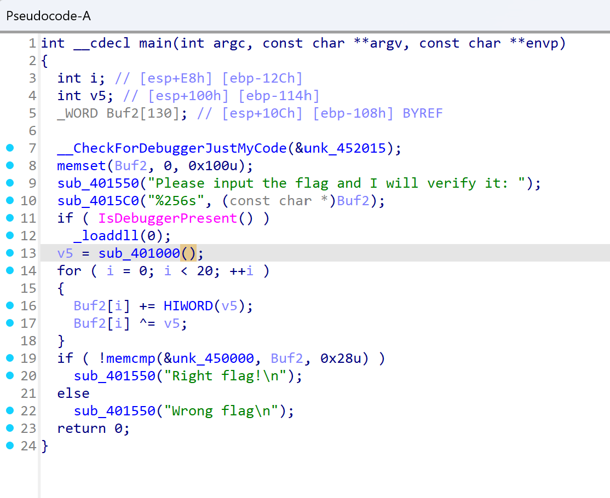
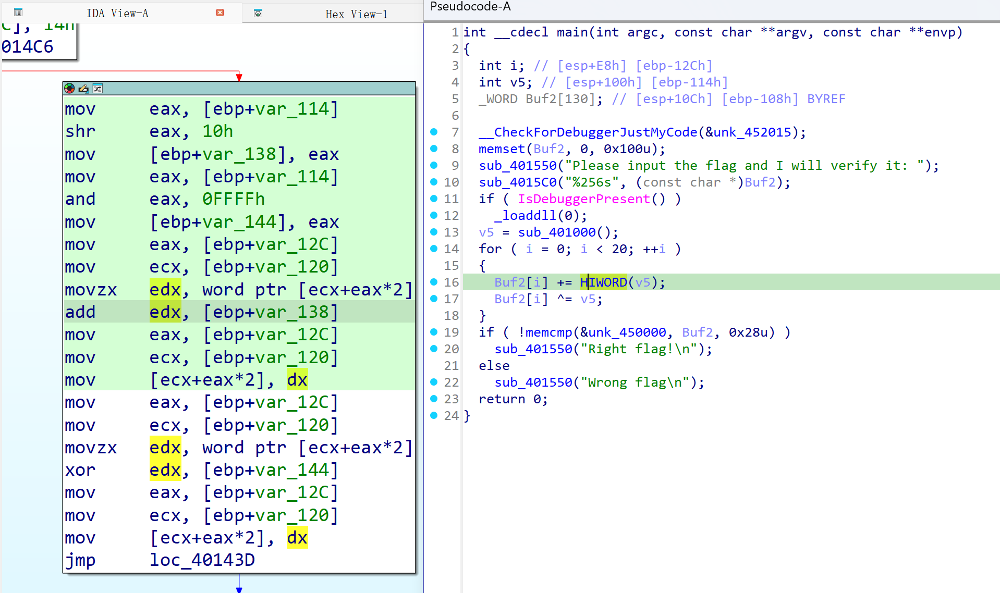
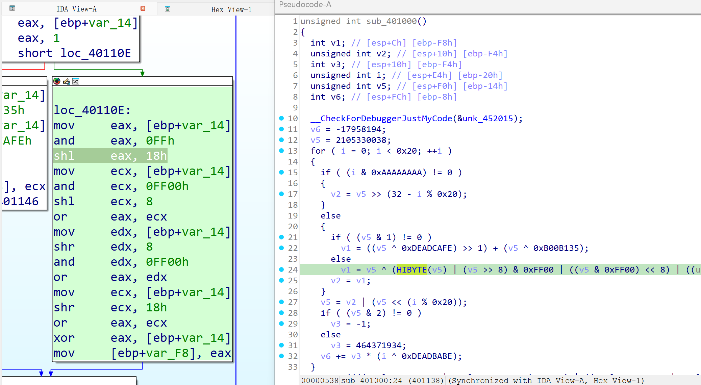

> 第八届ZJ CTF预赛RE1

<!-- more -->

点开pseudocode,



发现是对buf2进行加密，

显然v5就是加密的key

而sub_401000这个函数就是为key赋值

那么只要复现sub_401000函数，得出key即可

> 这里有两个没见过的函数，
> 
> HIWORD:   取出dword中的高位word
> 
> HIBYTE:  取出dword中的高位byte
> 
> 不知道没关系，在asm里有很清晰的解释
> 
> (pseudocode里遇到不懂的先看asm)





```c
#HIWORD
uint32_t val;
uint16_t hi = val >> 16;

#HIBYTE
uint32_t val;
uint8_t hi = val >> 24;
```

> 注意Buf2的类型，是word，所以从.data段dump的时候注意一下

编写dec

```c
#include <bits/stdc++.h>
using namespace std;

uint16_t cipher[20] = {
    0xA9E9, 0xA7F8, 0xA2F9, 0xD620, 0xD69A, 
    0xD9C8, 0xD399, 0x85CB, 0xD29B, 0xD5C7, 
    0x8496, 0xD4C9, 0xD89A, 0xD7CA, 0xD59C, 
    0x85C8, 0xD597, 0x859E, 0xD49C, 0x6DCA
};

uint32_t key = 109440544;

int main() {
    for (int i = 0; i < 20; i++) {
        cipher[i] ^= key;
        cipher[i] -= (key>>16);
    }
    for (int i = 0; i < 20; i++) {
        cout.write(reinterpret_cast<char *>(&cipher[i]),sizeof(cipher[i]));
    }
    return 0;
}

// DASCTF{152c147fe66b51dd450e375ce259e74e}
```
