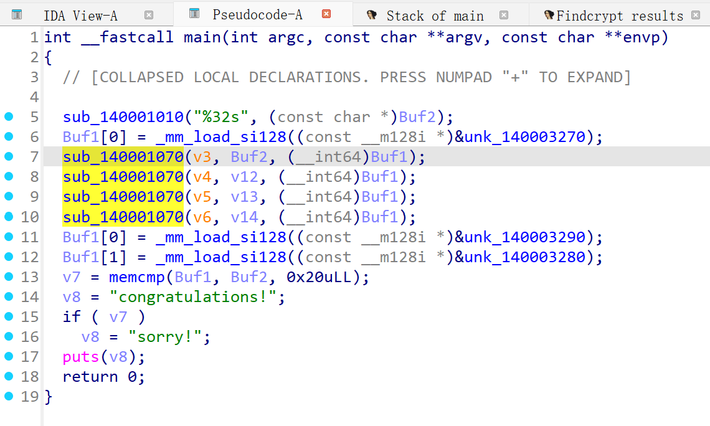
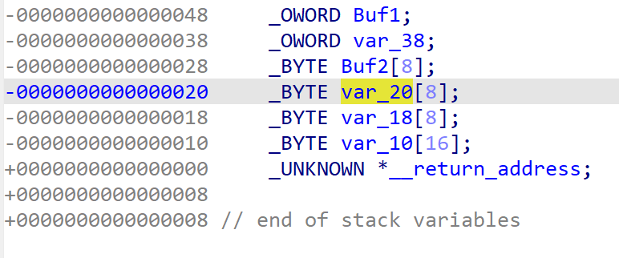
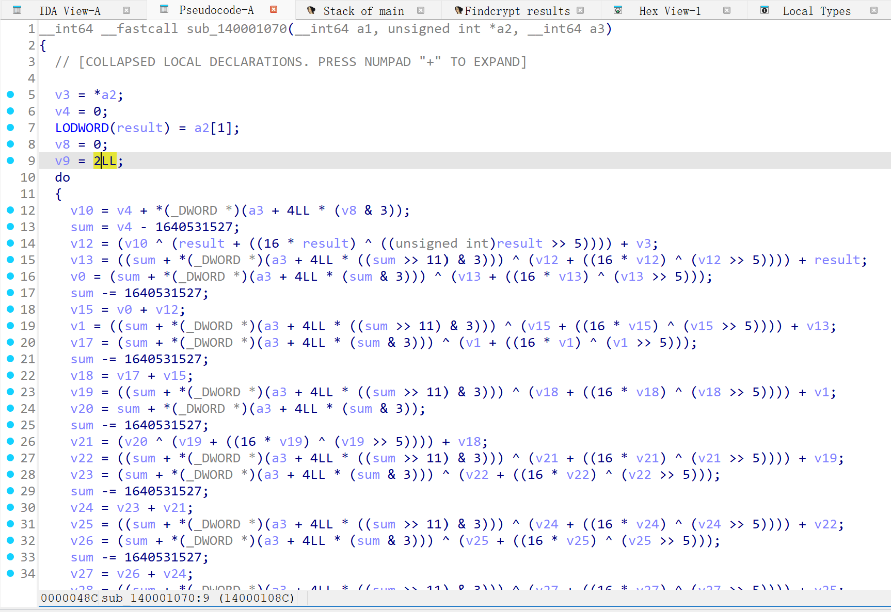
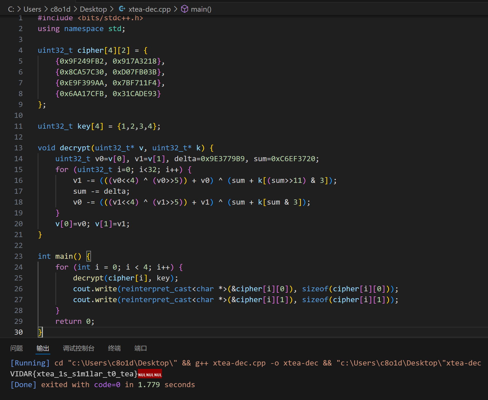

# Easyxtea

> <https://hgame.vidar.club/games/8/challenges?challenge=99>

<!-- more -->

分析pseudocode,

非常简洁清晰的流程，
读入用户32字节字符串，存入Buf2，
将xmmword_140003270的数据读入Buf1，
四组tea家族加密，

点击v12，v13，v14发现这是在栈上连续的32字节空间，

也就是plain存到Buf2的时候事实上后24位是注入到v12，v13，v14的
即
`Buf2 = [0~7]`
`v12 = [8~15]`
`v13 = [16~23]`
`v14 = [24~31]`
这就弄清了每组加密是在加密哪段plain，

点进去看一下是什么茶

标准的x茶，
数一下魔数的出现次数为16次，do-while循环**两次**，即16*2=32轮

接下来就是获取key和cipher，
pseudocode里有xmmword_1400032XX的数据，点开看看

获得key和cipher，
cipher为两组128bit，对应四组x茶加密，

注意这里有一个坑点，在组合加密后plain的时候，是先xmmword_140003290，后xmmword_140003280
也就是倒过来，90地址段的是cipher前16字节，80段是后16字节，

编写dec
```c
#include <bits/stdc++.h>
using namespace std;

uint32_t cipher[4][2] = {
    {0x9F249FB2, 0x917A3218},
    {0x8CA57C30, 0xD07FB03B},
    {0xE9F399AA, 0x7BF711F4},
    {0x6AA17CFB, 0x31CADE93}
};

uint32_t key[4] = {1,2,3,4};

void decrypt(uint32_t* v, uint32_t* k) {
    uint32_t v0=v[0], v1=v[1], delta=0x9E3779B9, sum=0xC6EF3720;
    for (uint32_t i=0; i<32; i++) {
        v1 -= (((v0<<4) ^ (v0>>5)) + v0) ^ (sum + k[(sum>>11) & 3]);
        sum -= delta;
        v0 -= (((v1<<4) ^ (v1>>5)) + v1) ^ (sum + k[sum & 3]);
    }
    v[0]=v0; v[1]=v1;
}

int main() {
    for (int i = 0; i < 4; i++) {
        decrypt(cipher[i], key);
        cout.write(reinterpret_cast<char *>(&cipher[i][0]), sizeof(cipher[i][0]));
        cout.write(reinterpret_cast<char *>(&cipher[i][1]), sizeof(cipher[i][1]));
    }
    return 0;
}
```

