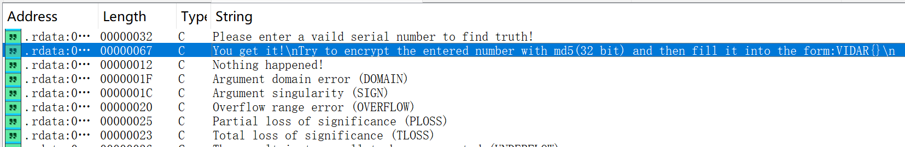
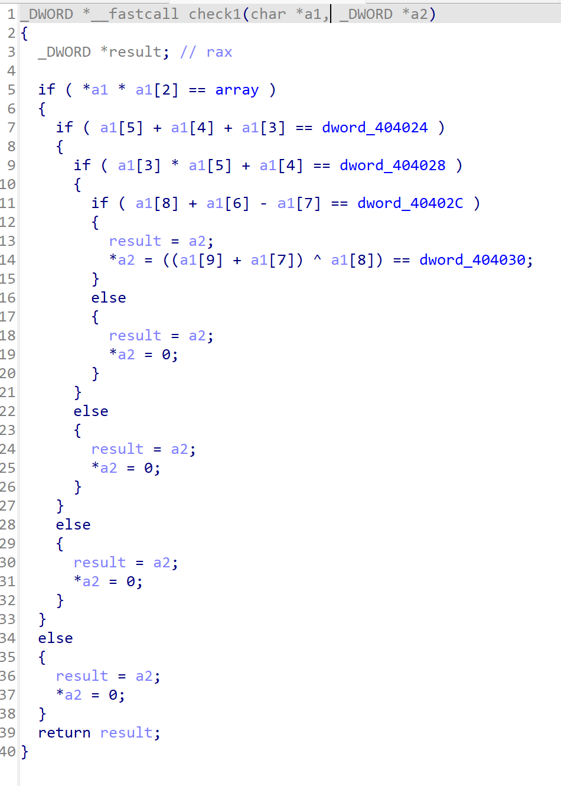
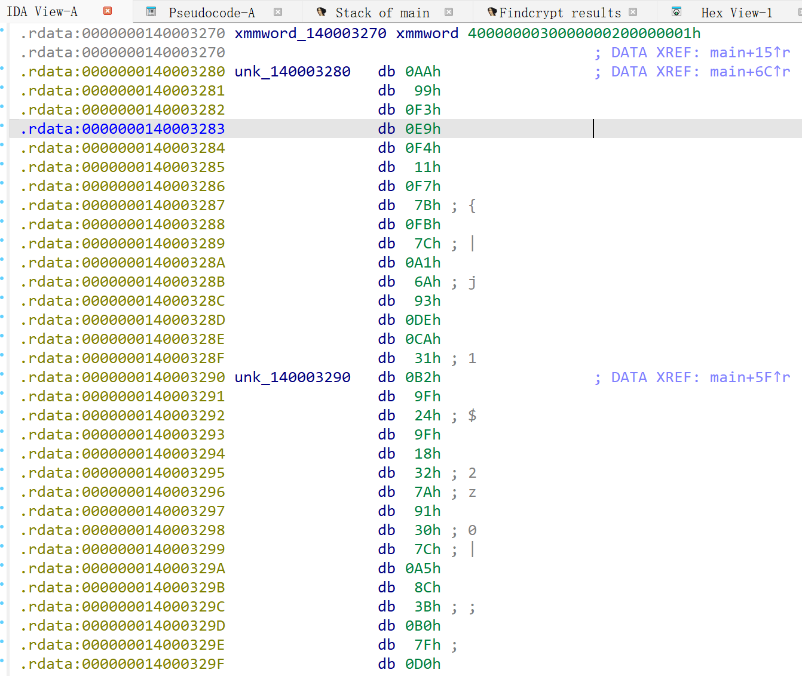

菜菜
<!-- more -->

## EasyUPX

> <https://hgame.vidar.club/games/8/challenges?challenge=121>

根据题目名称，

> upx -d main.exe

成功解包，拖入IDA, 先看看Strings


显然这是一个b64换表，dump下custom_table和ciphertext解码即可

---

## Z333333

> <https://hgame.vidar.club/games/8/challenges?challenge=105>

先看Strings,



获知flag格式，且需要使用MD5加密

然后分析pseudocode

有一个reverse函数，看一下


发现实现了一串数字中每组偶数项和奇数项交换，这是一个预处理

然后看到有check1,check2



发现这其实是对用户输入argv[1]这串数字的一系列约束，

v5,v4分别表示是否满足约束，

在main中最后的判断中，若v5,v4为true，且满足一个额外条件

```c
argv[1][6] == 50
```

的输入即为plain

接下来编写脚本即可~~（这题暴搜脚本写起来太麻烦了，请gpt出手）~~

```python
def reverse_pairs(s: str) -> str:
    lst = list(s)
    for i in range(0, len(lst)//2 * 2, 2):
        lst[i], lst[i+1] = lst[i+1], lst[i]
    return ''.join(lst)

def verify(post: str) -> bool:
    a = [ord(c) for c in post]
    if len(a) < 10:
        return False
    array_dword = 0x00000AF0  #小端存储F0 0A 00 00 
    d404024 = 0x98
    d404028 = 0x9F4
    d40402C = 0x33
    d404030 = 0x53
    d404034 = 0x6B
    d404038 = 0x5
    d40403C = 0x145

    # check2: a[2]+a[1]==107 and a[2]-a[1]==5
    if not (a[2] + a[1] == d404034 and a[2] - a[1] == d404038):
        return False
    # check2 last part: (a5 * a8) >> 3 == 0x145  => a5*a8 == 0x145 << 3 == 2600
    if (a[5] * a[8]) >> 3 != d40403C:
        return False
    # check1 first: a0 * a2 == array_dword
    if a[0] * a[2] != array_dword:
        return False
    # next: a5 + a4 + a3 == d404024
    if a[5] + a[4] + a[3] != d404024:
        return False
    # next: a3 * a5 + a4 == d404028
    if a[3] * a[5] + a[4] != d404028:
        return False
    # next: a8 + a6 - a7 == d40402C
    if a[8] + a[6] - a[7] != d40402C:
        return False
    # final: ((a9 + a7) ^ a8) == d404030
    if ((a[9] + a[7]) ^ a[8]) != d404030:
        return False
    # argv[1][6] == 50 constraint (注意：check 在 Reverse 之后，所以这是 post-reverse 的索引)
    if a[6] != 50:
        return False
    return True

# 穷举：'0'-'9'
digits = list(range(48, 58))

solutions = []
# 已知由 check2 解出的 a2=56 ('8'), a1=51 ('3')
fixed = {0: None, 1:51, 2:56}  # a0 未定 yet (由 a0*a2 == 2800 确定)

# 通过 a0 * a2 == 2800 得到 a0 = 2800 / a2 = 50 ('2')
array_dword = 0x00000AF0
a2 = 56
a0 = array_dword // a2
if array_dword % a2 != 0:
    raise SystemExit("无法整除，假设数字范围可能不止 0-9。")
fixed[0] = a0

# 搜索 a3,a4,a5 满足 a5 + a4 + a3 == 152 且 a3*a5 + a4 == 2548
for a3 in digits:
    for a5 in digits:
        a4 = 152 - (a3 + a5)
        if a4 < 48 or a4 > 57:
            continue
        if a3 * a5 + a4 != 2548:
            continue
        # 现在 a3,a4,a5 满足前半约束，继续搜索 a6,a7,a8,a9
        # 由 (a5 * a8) >>3 == 325 => a5 * a8 == 325 << 3 == 2600
        if (a5 * 2600) % a5 != 0:  # 只是形式检查（无实际意义），保留逻辑清晰
            pass
        # a8 必须能整除 2600
        if 2600 % a5 != 0:
            continue
        a8 = 2600 // a5
        if a8 < 48 or a8 > 57:
            continue
        # a6,a7,a9 枚举满足：
        # a8 + a6 - a7 == 51  -> a6 - a7 == 51 - a8
        need_diff = 51 - a8
        for a6 in digits:
            a7 = a6 - need_diff
            if a7 < 48 or a7 > 57:
                continue
            # 最后一个： ((a9 + a7) ^ a8) == 83  -> (a9 + a7) == some value where xor with a8 equals 83
            for a9 in digits:
                if ((a9 + a7) ^ a8) == 83:
                    # 组装 candidate
                    a = [fixed[0], fixed[1], fixed[2], a3, a4, a5, a6, a7, a8, a9]
                    post = ''.join(chr(x) for x in a)
                    if verify(post):
                        solutions.append(post)

for post in solutions:
    original = reverse_pairs(post)  # 程序实际接收的 argv[1]
    print("post-Reverse 用于校验的字符串:", post)
    print("程序实际接收的 argv[1]:", original)

# post-Reverse 用于校验的字符串: 2380442120
# 程序实际接收的 argv[1]: 3208441202    
```

ok，这样就只剩最后一步——MD5(32bit)加密，直接调用python库散列函数生成digest

```python
import hashlib

def md5_encrypt(text: str, length: int = 32) -> str:
    md5_value = hashlib.md5(text.encode()).hexdigest()  # 32位小写
    if length == 16:
        return md5_value[8:24]  # 取中间16位
    return md5_value

s = "3208441202"
print("MD5(32位):", md5_encrypt(s, 32))
print("MD5(16位):", md5_encrypt(s, 16))

# MD5(32位): 38435ec59c487c117565576c84476a22
# MD5(16位): 9c487c117565576c
```

> 这道题一开始上传的是没有argv[1][6]==50约束的版本，存在多解
> 
> 以至于苯人做了半天没做出来，怀疑人生了
> 
> 好在shiori测过之后紧急更换了版本

---

## simple tea

> <https://hgame.vidar.club/games/8/challenges?challenge=171>

先分析pseudocode，
发现有tea_encrypt函数，知道这里有tea加密
~~其实也可以用findcrypt插件，但这里没必要~~

> do-while这段循环事实上是用来约束用户输入字符串长度的，
> 依据v8，v9，v10的检验，可以看出plain长度为3*8=24字节，

tea_encrypt的三次调用说明程序是将用户24字节输入拆成3段qword分段加密，

点进加密函数看一下，

可以发现是标准TEA

那么接下来只需要获取key，编写dec即可

点开key看看


这似乎不是真正的key
（当然这是基于猜测，也可以去验证一下）

这时候看看有没有什么隐藏的初始化函数，改变key的硬编码的

发现在main上方有一个init_key，
点开看看，


> 建议多按按H将decimal全部转成hex，有时候会下意识搞混

显然，key的硬编码在加密前被改成了
`74 68 69 73 5F 69 73 5F 72 65 61 6C 5F 6B 79 21`
`this_is_real_ky!`
**《疑问句改肯定句》**

这样就获得了正确的key，dec如下

```c
#include <bits/stdc++.h>
using namespace std;

uint32_t cipher[3][2] = {
    {0xE66A6B7B, 0xA3ECA28E},
    {0x6CCF6CF4, 0x99043B89},
    {0x7EFD20CC, 0xD5536FC9}
};

uint32_t key[4] = {
    0x73696874,0x5F73695F,
    0x6C616572,0x21796B5F
};

void decrypt(uint32_t *v, uint32_t *k) {
    uint32_t v0 = v[0], v1 = v[1], sum = 0xC6EF3720, i;
    uint32_t delta = 0x9e3779b9;
    uint32_t k0 = k[0], k1 = k[1], k2 = k[2], k3 = k[3];
    for (i = 0; i < 32; i++) {
        v1 -= ((v0 << 4) + k2) ^ (v0 + sum) ^ ((v0 >> 5) + k3);
        v0 -= ((v1 << 4) + k0) ^ (v1 + sum) ^ ((v1 >> 5) + k1);
        sum -= delta;
    }
    v[0] = v0;
    v[1] = v1;
}

int main() {
    for (int i = 0; i < 3; i++) {
        decrypt(cipher[i], key);
        cout.write(reinterpret_cast<char *>(&cipher[i][0]), sizeof(cipher[i][0]));
        cout.write(reinterpret_cast<char *>(&cipher[i][1]), sizeof(cipher[i][1]));
    }
    return 0;
}

// VIDAR{h2llo_7ea_world!!}
```

---

## Easyxtea

> <https://hgame.vidar.club/games/8/challenges?challenge=99>

分析pseudocode,

非常简洁清晰的流程，
读入用户32字节字符串，存入Buf2，
将xmmword_140003270的数据读入Buf1，
四组tea家族加密，

点击v12，v13，v14发现这是在栈上连续的32字节空间，

也就是plain存到Buf2的时候事实上后24位是注入到v12，v13，v14的
即
`Buf2 = [0~7]`
`v12 = [8~15]`
`v13 = [16~23]`
`v14 = [24~31]`
这就弄清了每组加密是在加密哪段plain，

点进去看一下是什么茶

标准的x茶，
数一下魔数的出现次数为16次，do-while循环**两次**，即16*2=32轮

接下来就是获取key和cipher，
pseudocode里有xmmword_1400032XX的数据，点开看看

获得key和cipher，
cipher为两组128bit，对应四组x茶加密，

注意这里有一个坑点，在组合加密后plain的时候，是先xmmword_140003290，后xmmword_140003280
也就是倒过来，90地址段的是cipher前16字节，80段是后16字节，

编写dec

```c
#include <bits/stdc++.h>
using namespace std;

uint32_t cipher[4][2] = {
    {0x9F249FB2, 0x917A3218},
    {0x8CA57C30, 0xD07FB03B},
    {0xE9F399AA, 0x7BF711F4},
    {0x6AA17CFB, 0x31CADE93}
};

uint32_t key[4] = {1,2,3,4};

void decrypt(uint32_t* v, uint32_t* k) {
    uint32_t v0=v[0], v1=v[1], delta=0x9E3779B9, sum=0xC6EF3720;
    for (uint32_t i=0; i<32; i++) {
        v1 -= (((v0<<4) ^ (v0>>5)) + v0) ^ (sum + k[(sum>>11) & 3]);
        sum -= delta;
        v0 -= (((v1<<4) ^ (v1>>5)) + v1) ^ (sum + k[sum & 3]);
    }
    v[0]=v0; v[1]=v1;
}

int main() {
    for (int i = 0; i < 4; i++) {
        decrypt(cipher[i], key);
        cout.write(reinterpret_cast<char *>(&cipher[i][0]), sizeof(cipher[i][0]));
        cout.write(reinterpret_cast<char *>(&cipher[i][1]), sizeof(cipher[i][1]));
    }
    return 0;
}

// VIDAR{xtea_1s_s1m1lar_t0_tea}
```
