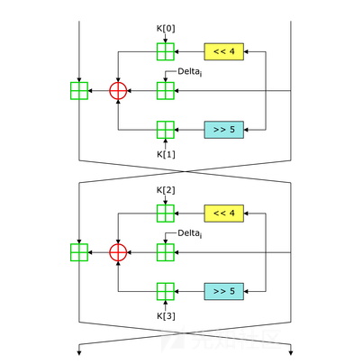

A cup of tea
<!-- more -->

## TEA

> Tiny Encryption Algorithm， 微型加密算法

### Basic-TEA

标准TEA，

```c
void encrypt(uint32_t* v, uint32_t* k) {
    uint32_t v0=v[0], v1=v[1], sum=0;
    uint32_t delta=0x9e3779b9;
    uint32_t k0=k[0], k1=k[1], k2=k[2], k3=k[3];
    for (uint32_t i = 0; i < 32; i++) {
        sum += delta;
        v0 += ((v1<<4) + k0) ^ (v1 + sum) ^ ((v1>>5) + k1);
        v1 += ((v0<<4) + k2) ^ (v0 + sum) ^ ((v0>>5) + k3);
    }
    v[0]=v0; v[1]=v1;
}

void decrypt(uint32_t* v, uint32_t* k) {
    uint32_t v0=v[0], v1=v[1], sum=0xC6EF3720;
    uint32_t delta=0x9e3779b9;
    uint32_t k0=k[0], k1=k[1], k2=k[2], k3=k[3];
    for (uint32_t i = 0; i < 32; i++) {
        v1 -= ((v0<<4) + k2) ^ (v0 + sum) ^ ((v0>>5) + k3);
        v0 -= ((v1<<4) + k0) ^ (v1 + sum) ^ ((v1>>5) + k1);
        sum -= delta;
    }
    v[0]=v0; v[1]=v1;
}
```

特征：**魔数**(image number)，即delta，标准值为**0x9E3779B9/0x61C88647**

> 0x9E3779B9 = - 0x61C88647, 黄金分割比



[simple tea](https://c0d4.ink/2025/11/06/Hgame%20Mini%202025/#simple-tea)

---

### XTEA

> xtea is similar to tea

密钥变为根据sum值的轮换使用，`&3` 保证了k的索引在0~3

同时v0,v1的轮换，异或，加法也有调整

```c
void encrypt(uint32_t* v, uint32_t* k) {
    uint32_t v0=v[0], v1=v[1], sum=0, delta=0x9E3779B9;
    for (uint32_t i = 0; i < 32; i++) {
        v0 += (((v1<<4) ^ (v1>>5)) + v1) ^ (sum + k[sum & 3]);
        sum += delta;
        v1 += (((v0<<4) ^ (v0>>5)) + v0) ^ (sum + k[(sum>>11) & 3]);
    }
    v[0]=v0; v[1]=v1;
}

void decrypt(uint32_t* v, uint32_t* k) {
    uint32_t v0=v[0], v1=v[1], delta=0x9E3779B9, sum=0xC6EF3720;
    for (uint32_t i=0; i<32; i++) {
        v1 -= (((v0<<4) ^ (v0>>5)) + v0) ^ (sum + k[(sum>>11) & 3]);
        sum -= delta;
        v0 -= (((v1<<4) ^ (v1>>5)) + v1) ^ (sum + k[sum & 3]);
    }
    v[0]=v0; v[1]=v1;
}
```

[Easyxtea](https://c0d4.ink/2025/11/06/Hgame%20Mini%202025/#easyxtea)

---

### XXTEA

xxtea is complicated

```c
void encrypt(uint32_t* v, uint32_t* k) {
    uint32_t v0=v[0], v1=v[1], sum=0, delta=0x9E3779B9;
    for (uint32_t i = 0; i < 32; i++) {
        sum += delta;
        uint32_t e = (sum >> 2) & 3;
        v0 += (((v1 << 4) ^ (v1 >> 5)) + (v1 ^ sum)) ^ (k[(0 & 3) ^ e] ^ v1);
        v1 += (((v0 << 4) ^ (v0 >> 5)) + (v0 ^ sum)) ^ (k[(1 & 3) ^ e] ^ v0);
    }
    v[0] = v0; v[1] = v1;
}

void decrypt(uint32_t* v, uint32_t* k) {
    uint32_t v0=v[0], v1=v[1], delta=0x9E3779B9, sum=0xC6EF3720;
    for (uint32_t i = 0; i < 32; i++) {
        uint32_t e = (sum >> 2) & 3;
        v1 -= (((v0 << 4) ^ (v0 >> 5)) + (v0 ^ sum)) ^ (k[(1 & 3) ^ e] ^ v0);
        v0 -= (((v1 << 4) ^ (v1 >> 5)) + (v1 ^ sum)) ^ (k[(0 & 3) ^ e] ^ v1);
        sum -= delta;
    }
    v[0] = v0; v[1] = v1;
}
```


[Hardxxtea]()
