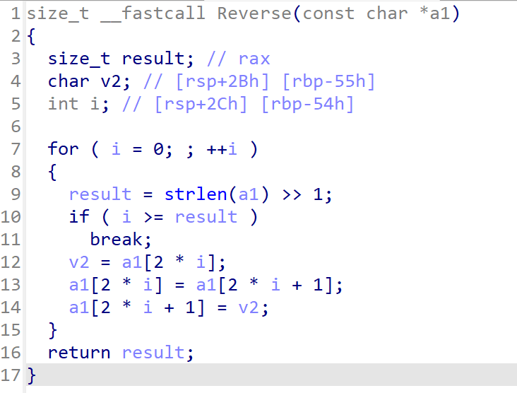
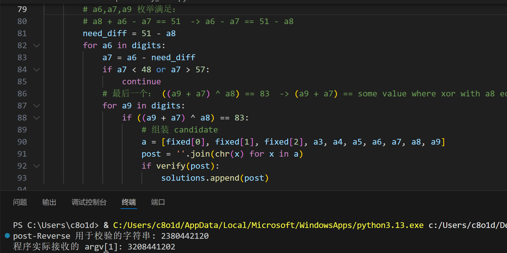
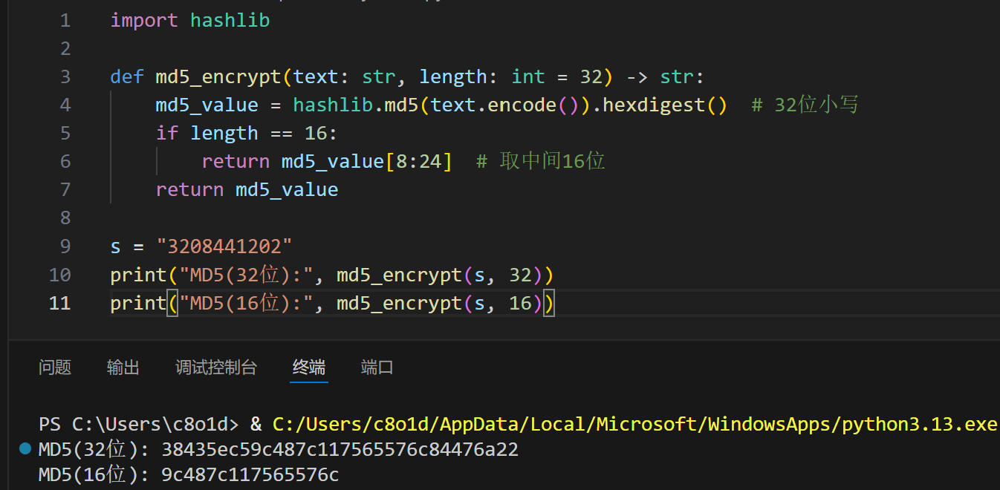

# Z333333

先看Strings,


获知flag格式，且需要使用MD5加密

然后分析pseudocode

有一个reverse函数，看一下



发现实现了一串数字中每组偶数项和奇数项交换，这是一个预处理

然后看到有check1,check2


发现这其实是对用户输入argv[1]这串数字的一系列约束，

v5,v4分别表示是否满足约束，

在main中最后的判断中，若v5,v4为true，且满足一个额外条件

```c
argv[1][6] == 50
```

的输入即为plain

接下来编写脚本即可~~（这题暴搜脚本写起来太麻烦了，请gpt出手）~~

```python
def reverse_pairs(s: str) -> str:
    lst = list(s)
    for i in range(0, len(lst)//2 * 2, 2):
        lst[i], lst[i+1] = lst[i+1], lst[i]
    return ''.join(lst)

def verify(post: str) -> bool:
    a = [ord(c) for c in post]
    if len(a) < 10:
        return False
    array_dword = 0x00000AF0  #小端存储F0 0A 00 00 
    d404024 = 0x98
    d404028 = 0x9F4
    d40402C = 0x33
    d404030 = 0x53
    d404034 = 0x6B
    d404038 = 0x5
    d40403C = 0x145

    # check2: a[2]+a[1]==107 and a[2]-a[1]==5
    if not (a[2] + a[1] == d404034 and a[2] - a[1] == d404038):
        return False
    # check2 last part: (a5 * a8) >> 3 == 0x145  => a5*a8 == 0x145 << 3 == 2600
    if (a[5] * a[8]) >> 3 != d40403C:
        return False
    # check1 first: a0 * a2 == array_dword
    if a[0] * a[2] != array_dword:
        return False
    # next: a5 + a4 + a3 == d404024
    if a[5] + a[4] + a[3] != d404024:
        return False
    # next: a3 * a5 + a4 == d404028
    if a[3] * a[5] + a[4] != d404028:
        return False
    # next: a8 + a6 - a7 == d40402C
    if a[8] + a[6] - a[7] != d40402C:
        return False
    # final: ((a9 + a7) ^ a8) == d404030
    if ((a[9] + a[7]) ^ a[8]) != d404030:
        return False
    # argv[1][6] == 50 constraint (注意：check 在 Reverse 之后，所以这是 post-reverse 的索引)
    if a[6] != 50:
        return False
    return True

# 穷举：'0'-'9'
digits = list(range(48, 58))

solutions = []
# 已知由 check2 解出的 a2=56 ('8'), a1=51 ('3')
fixed = {0: None, 1:51, 2:56}  # a0 未定 yet (由 a0*a2 == 2800 确定)

# 通过 a0 * a2 == 2800 得到 a0 = 2800 / a2 = 50 ('2')
array_dword = 0x00000AF0
a2 = 56
a0 = array_dword // a2
if array_dword % a2 != 0:
    raise SystemExit("无法整除，假设数字范围可能不止 0-9。")
fixed[0] = a0

# 搜索 a3,a4,a5 满足 a5 + a4 + a3 == 152 且 a3*a5 + a4 == 2548
for a3 in digits:
    for a5 in digits:
        a4 = 152 - (a3 + a5)
        if a4 < 48 or a4 > 57:
            continue
        if a3 * a5 + a4 != 2548:
            continue
        # 现在 a3,a4,a5 满足前半约束，继续搜索 a6,a7,a8,a9
        # 由 (a5 * a8) >>3 == 325 => a5 * a8 == 325 << 3 == 2600
        if (a5 * 2600) % a5 != 0:  # 只是形式检查（无实际意义），保留逻辑清晰
            pass
        # a8 必须能整除 2600
        if 2600 % a5 != 0:
            continue
        a8 = 2600 // a5
        if a8 < 48 or a8 > 57:
            continue
        # a6,a7,a9 枚举满足：
        # a8 + a6 - a7 == 51  -> a6 - a7 == 51 - a8
        need_diff = 51 - a8
        for a6 in digits:
            a7 = a6 - need_diff
            if a7 < 48 or a7 > 57:
                continue
            # 最后一个： ((a9 + a7) ^ a8) == 83  -> (a9 + a7) == some value where xor with a8 equals 83
            for a9 in digits:
                if ((a9 + a7) ^ a8) == 83:
                    # 组装 candidate
                    a = [fixed[0], fixed[1], fixed[2], a3, a4, a5, a6, a7, a8, a9]
                    post = ''.join(chr(x) for x in a)
                    if verify(post):
                        solutions.append(post)

for post in solutions:
    original = reverse_pairs(post)  # 程序实际接收的 argv[1]
    print("post-Reverse 用于校验的字符串:", post)
    print("程序实际接收的 argv[1]:", original)
```



ok，这样就只剩最后一步——MD5(32bit)加密，直接调用python库散列函数

```python
import hashlib

def md5_encrypt(text: str, length: int = 32) -> str:
    md5_value = hashlib.md5(text.encode()).hexdigest()  # 32位小写
    if length == 16:
        return md5_value[8:24]  # 取中间16位
    return md5_value

s = "3208441202"
print("MD5(32位):", md5_encrypt(s, 32))
print("MD5(16位):", md5_encrypt(s, 16))
```




---


> 写在最后：
> 
> 这道题一开始上传的是没有argv[1][6]==50约束的版本，存在多解
> 
> 以至于苯人做了半天没做出来，怀疑人生了
> 
> 好在笨笨shiori测过之后紧急更换了版本
