> <https://hgame.vidar.club/training/9>
<!-- more -->

## week1

### PVZ

DIE

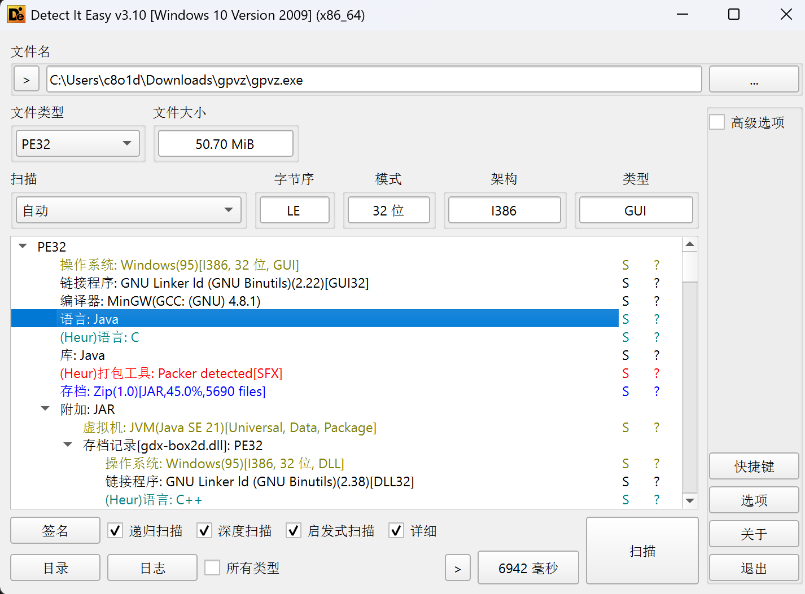

发现是一个封装在C++壳下的jar包

7zip打开gpvz.exe，解压

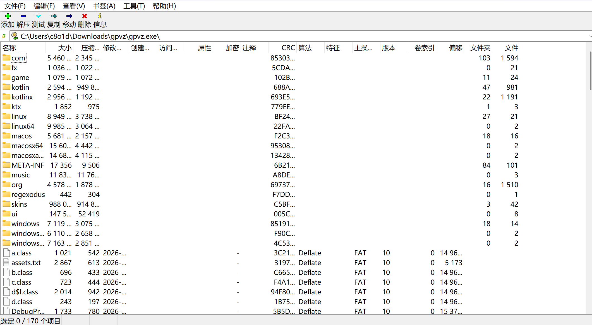

jadx分析一下gpvz文件夹，发现一个很扎眼的what_is_this.png

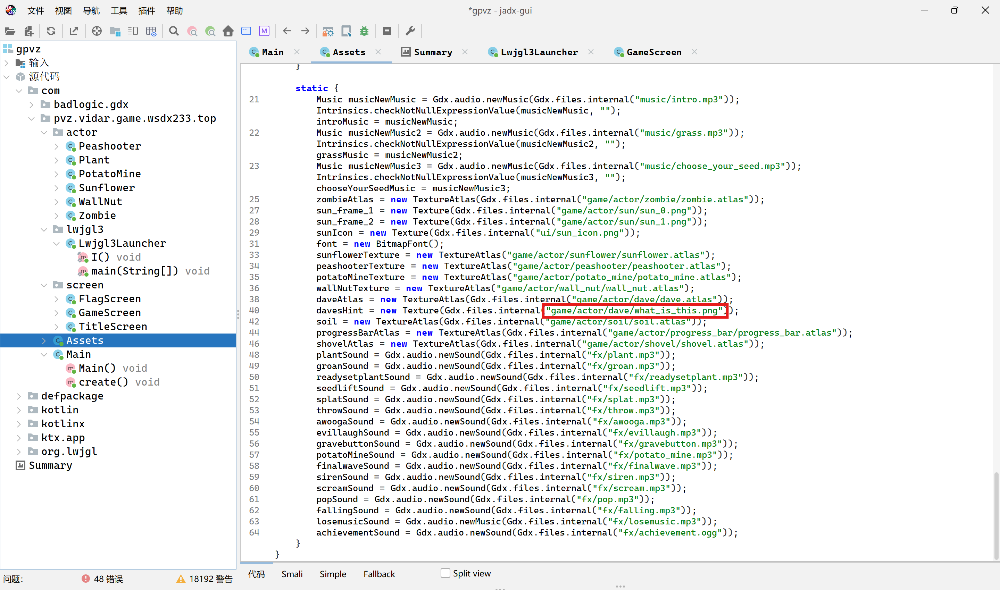

发现是“神秘仪式”的具体内容

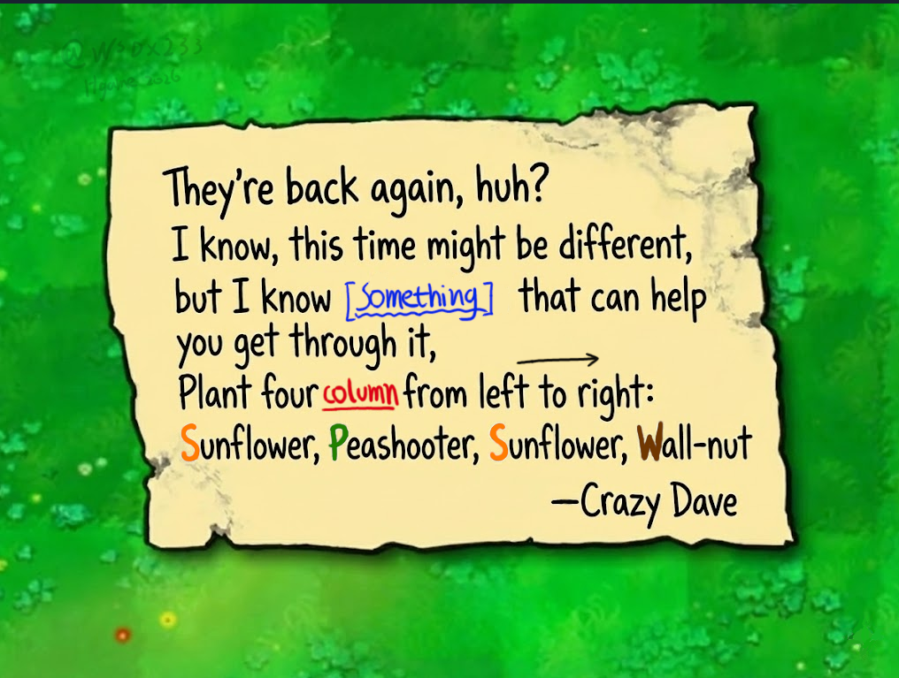

运行游戏，用一点作弊技巧在结束前摆出神秘阵型，获得flag

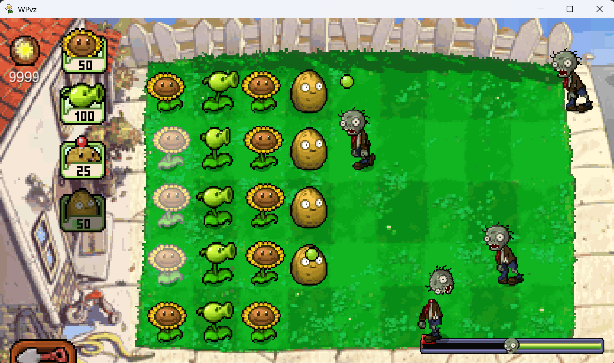

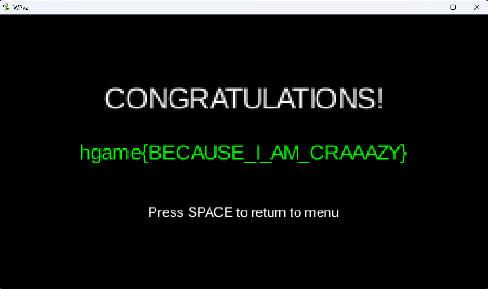

### 看不懂的华容道

IDA分析

无符号表，一坨sub_xxxxx函数，没有头绪

先看看字符串

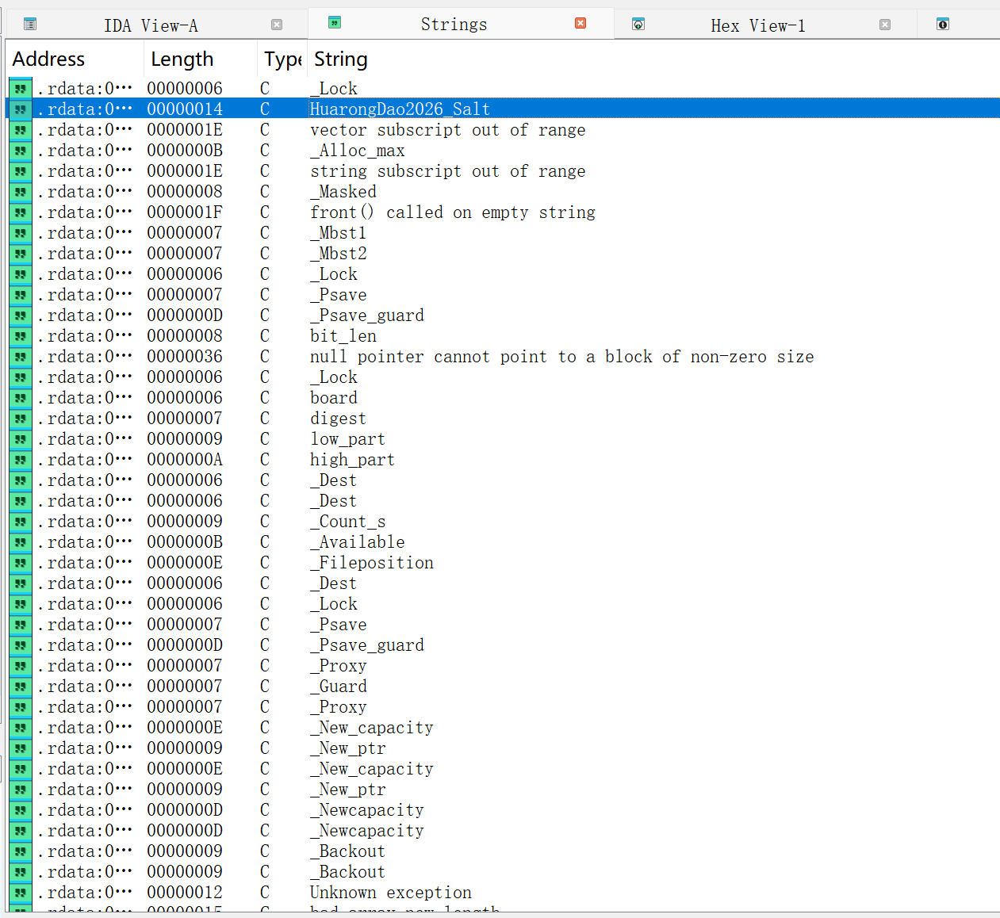

点进HuarongDao2026_Salt看看

跟踪到sub_1400266B0，发现是一个VM的depatcher

VM控制华容道运作

game.bin就是操作码表

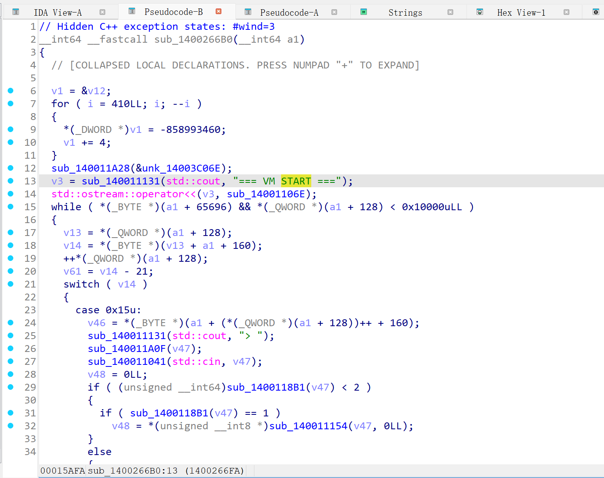

opcode：

- `0x15`：读用户输入（交互输入“编号+方向”）

- `0x16`：调用 `sub_140011212 -> sub_14001EC40`，重建棋盘状态编码

- `0x18`：对状态做哈希，写入寄存器

- `0x17`：打印两个 64-bit 组成的节点值

- `0xE0/E1/E2/E3`：跳转与条件判断

- `0xFF`：结束

棋盘编码

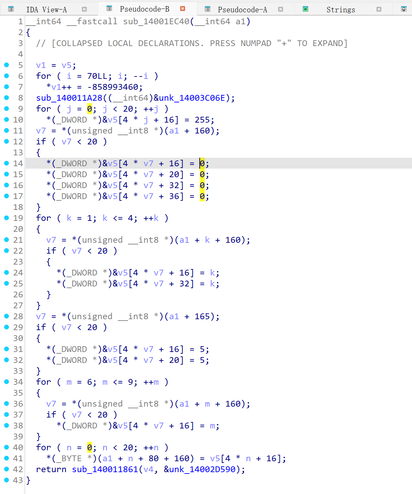

分析game.bin恢复初始棋盘为

> [ P1 ][ P0 ][ P0 ][ P2 ]
> [ P1 ][ P0 ][ P0 ][ P2 ]
> [ P5 ][ P5 ][ P4 ][ P3 ]
> [ P6 ][ P8 ][ P4 ][ P3 ]
> [ P7 ][ --- ][ --- ][ P9 ]

加密算法为md5，不过不重要，可以通过编写bfs脚本直接跑出符合题目要求的路径，直接运行exe输入，获得最终棋盘hash

> 特别要注意题目追加的条件：操作路径顺序按照棋子编号从小到大 操作顺序wasd

```python
from collections import deque

START = (1, 0, 3, 11, 10, 8, 12, 16, 13, 19)
DIRS = [('w', -4), ('a', -1), ('s', 4), ('d', 1)]

def piece_cells(anchor, pid):
    if pid == 0:
        return (anchor, anchor + 1, anchor + 4, anchor + 5)
    if 1 <= pid <= 4:
        return (anchor, anchor + 4)
    if pid == 5:
        return (anchor, anchor + 1)
    return (anchor,)

def valid_shape(anchor, pid):
    r, c = divmod(anchor, 4)
    if pid == 0:
        return r <= 3 and c <= 2
    if 1 <= pid <= 4:
        return r <= 3
    if pid == 5:
        return c <= 2
    return 0 <= anchor < 20

def build_occ(state):
    occ = [-1] * 20
    pcs = []
    for pid, a in enumerate(state):
        if not valid_shape(a, pid):
            return None, None
        cells = piece_cells(a, pid)
        for x in cells:
            if not (0 <= x < 20) or occ[x] != -1:
                return None, None
            occ[x] = pid
        pcs.append(cells)
    return occ, pcs

def can_move(cells, occ, ch, d):
    for x in cells:
        if ch == 'a' and x % 4 == 0:
            return False
        if ch == 'd' and x % 4 == 3:
            return False
        nx = x + d
        if not (0 <= nx < 20):
            return False
        if occ[nx] != -1 and nx not in cells:
            return False
    return True

def bfs():
    q = deque([START])
    prev = {START: (None, None)}
    while q:
        s = q.popleft()
        if s[0] == 13:
            path = []
            cur = s
            while prev[cur][0] is not None:
                p, act = prev[cur]
                path.append(act)
                cur = p
            path.reverse()
            return path
        occ, pcs = build_occ(s)
        if occ is None:
            continue
        for pid in range(10):
            cells = pcs[pid]
            for ch, d in DIRS:
                if can_move(cells, occ, ch, d):
                    ns = list(s)
                    ns[pid] += d
                    ns = tuple(ns)
                    if ns not in prev:
                        prev[ns] = (s, (pid, ch))
                        q.append(ns)
    return None

if __name__ == "__main__":
    path = bfs()
    print(len(path))
    print(" ".join(f"{pid}{ch}" for pid, ch in path))
```

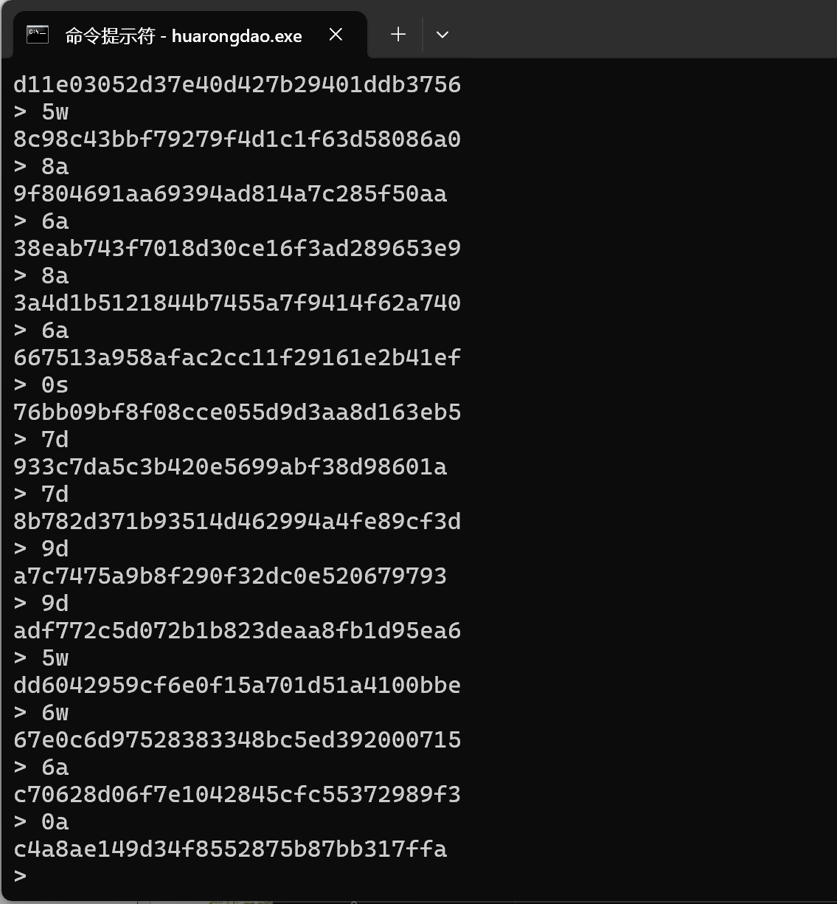

`hgame{c4a8ae149d34f8552875b87bb317ffa}`

### Signal Storm

DIE

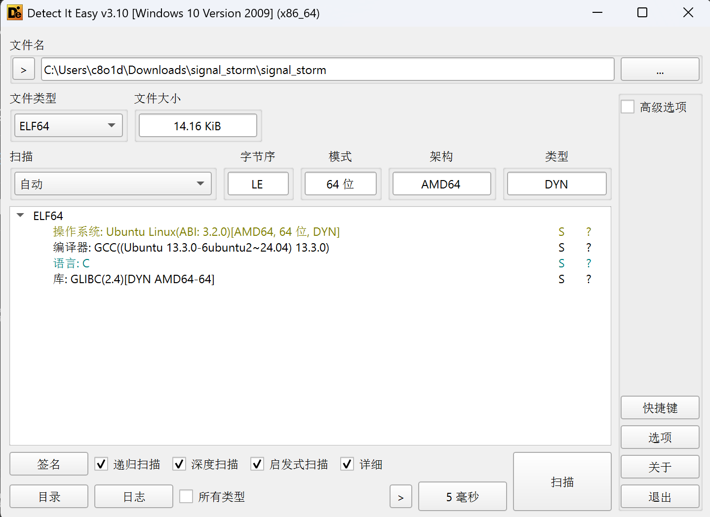

IDA分析

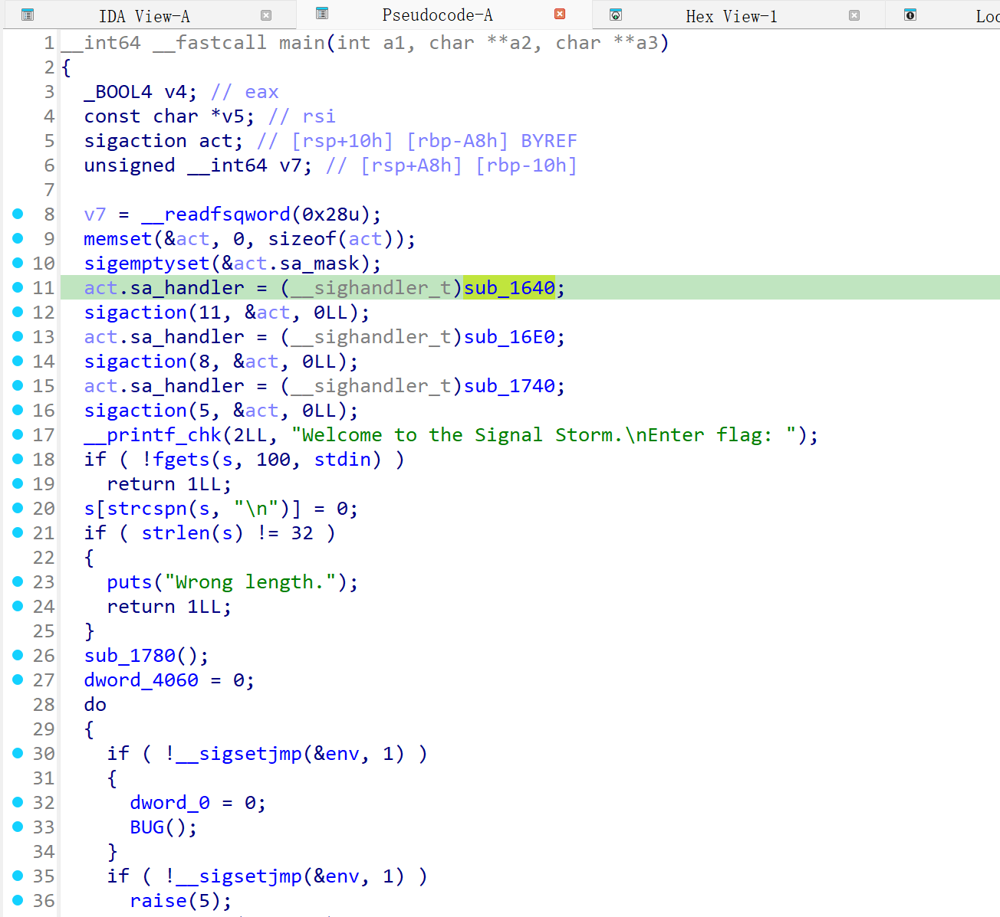

在main中注册了三个信号处理函数，通过BUG(),raise(5)异常调用，控制执行流

分析信号处理函数，发现这其实是一个**魔改 RC4 算法**：

- **`sub_1780` (KSA)**：利用原始字符串对 S 盒 (`byte_4100`) 进行初始化打乱。

- **`sub_1640` (PRGA变形)**：这是 RC4 的 S 盒交换逻辑，但它引入了 `aC0lmBe4ore7heS` 的当前字符参与运算。

- **`sub_1740` (密钥旋转)**：每生成一个字节的密钥，就将密钥字符串循环左移一位

- **`sub_16E0` (异或)**：执行标准的流密码异或操作：`s[i] ^= keystream[i]`

密文：

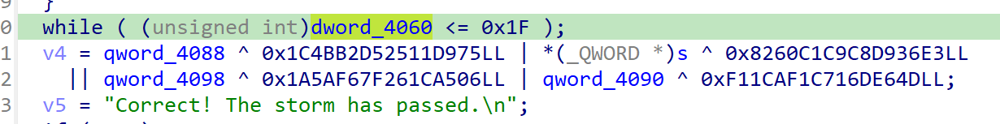

Exp:

```python
import struct

def solve():

    key_str = b"C0lm_be4ore_7he_st0rm"

    targets = [
        0x8260C1C9C8D936E3, #s[0:8]
        0x1C4BB2D52511D975, #s[8:16]
        0xF11CAF1C716DE64D, #s[16:24]
        0x1A5AF67F261CA506  #s[24:32]
    ]

    S = list(range(256))
    j = 0
    for i in range(256):
        j = (j + S[i] + key_str[i % 21]) % 256
        S[i], S[j] = S[j], S[i]
    i_ptr = 0
    j_ptr = 0
    current_rot_str = list(key_str)
    keystream = []

    for _ in range(32):
        i_ptr = (i_ptr + 1) % 256
        v2 = S[i_ptr]
        j_ptr = (j_ptr + v2 + current_rot_str[i_ptr % 21]) % 256
        S[i_ptr], S[j_ptr] = S[j_ptr], S[i_ptr]
        res_idx = (S[i_ptr] + S[j_ptr]) % 256
        keystream.append(S[res_idx])
        first = current_rot_str.pop(0)
        current_rot_str.append(first)
    ks_qwords = [
        struct.unpack("<Q", bytes(keystream[i:i+8]))[0] 
        for i in range(0, 32, 8)
    ]
    flag_parts = []
    for i in range(4):
        flag_parts.append(struct.pack("<Q", targets[i] ^ ks_qwords[i]))

    flag = b"".join(flag_parts)
    print(flag.decode(errors='ignore'))

if __name__ == "__main__":
    solve()

# hgame{Null_c0lm_wi7hout_0_storm}
```

### Noncesense

IDA分析驱动

DriverEntry -> sub_14000154C

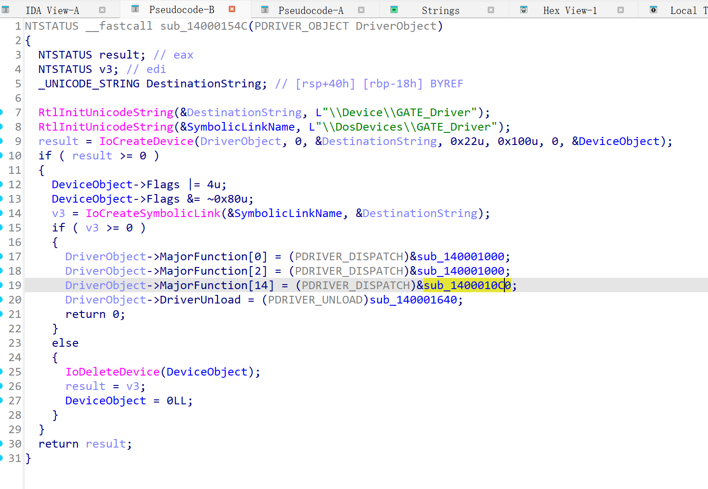

MajorFunction[0/2] = sub_140001000

MajorFunction[14] = sub_1400010C0

驱动核心在sub_1400010C0

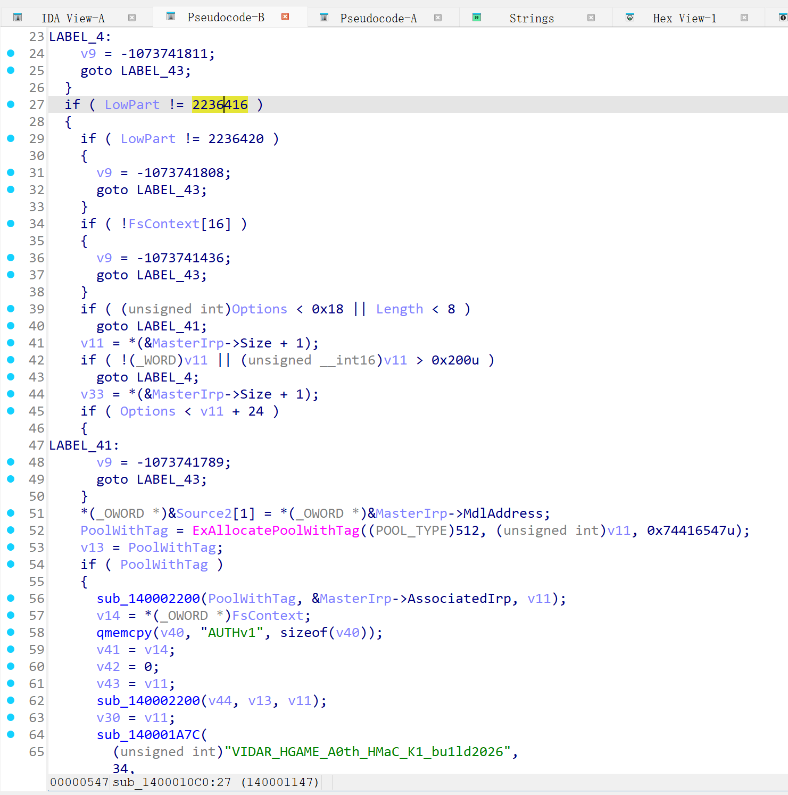

0x222000：发 nonce

FsContext 在 open 时通过`sub_140001668`生成 16 字节随机值

0x222004：验签 + 加密

构造 `AUTHv1 || nonce || 0 || len || payload`

调 `sub_140001A7C` 计算 HMAC-SHA256，比较前 16 字节签名  
常量 key：`VIDAR_HGAME_A0th_HMaC_K1_bu1ld2026`

`sub_1400016B0`：AES 单块加密（可见 Sbox、ShiftRows、MixColumns）

`sub_140001908`：AES-128 key schedule（Rcon 常量）

明文先 PKCS#7 padding，再每 16 字节块加密（ECB）

会话 AES key 派生

`sub_1400019B8`：

`v10 = HMAC_SHA256(key=00*32, msg=nonce16)`

`v39` 由 `byte_140003250` 经 `xor/ror` 变换得到 32 字节

`v11 = HMAC_SHA256(key=v10, msg=v39 || 0x01)`

AES key = `v11[:16]`

> 总结：
> 
> - KDF（两层 HMAC）
> 
> - AES-ECB

具体数据可以从.rdata，.text字段dump

IDA分析客户端

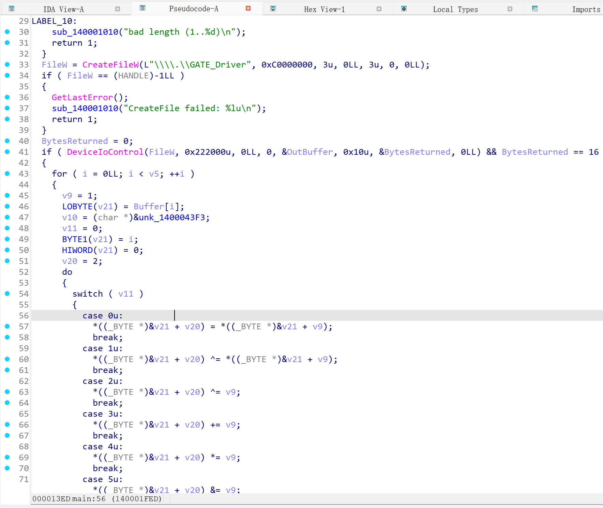

main流程：

1. 读用户输入

2. `CreateFile("\\\\.\\GATE_Driver")`

3. `DeviceIoControl(..., 0x222000, ...)` 取 nonce

4. 对输入每字节跑一段小型“指令机”变换（`unk_1400043F3`）

5. 构造 `AUTHv1` 包 + HMAC（`sub_140001A80`）

6. 调 `0x222004`

7. 成功后把返回密文写入 `Drv_blob.bin`

完整解密路线

从 `Drv_blob.bin` 出发：

1. 取前 16 字节为 `nonce`

2. 剩余为 `ciphertext`

3. 用驱动 KDF 复现 AES key

4. AES-ECB 解密 + 去 PKCS#7 padding，得到client变换后的明文

5. 按索引逐字节做指令机逆变换，恢复原始输入（flag）

Exp

```python
from Crypto.Cipher import AES
import hmac
import hashlib
import sys

BYTE_3250_HEX = "BFE743BAE2BFAB5291E64BA4200E2ED39179FBA4C10A2000F9EF029FEE029645"
byte_3250 = bytes.fromhex(BYTE_3250_HEX)

PROG_RAW = bytes([
    0x05,0x02,0x0D,
    0x04,0x02,0xC3,
    0x02,0x00,0x02,
    0x01,0x03,0x01,
    0x05,0x03,0x03,
    0x04,0x03,0x01,
    0x06,0x03,0x07,
    0x07,0x00,0x03,
    0x03,0x00,0x5A,
    0x00,0x00,0x00, 
    0x00,0x00,0x00, 
    0x00,0x00,0x00
])

def ror8(x: int, r: int) -> int:
    r &= 7
    return ((x >> r) | ((x << (8 - r)) & 0xFF)) & 0xFF

def rol8(x: int, r: int) -> int:
    r &= 7
    return (((x << r) & 0xFF) | (x >> (8 - r))) & 0xFF

def pkcs7_unpad(x: bytes) -> bytes:
    if not x:
        return x
    pad = x[-1]
    if pad == 0 or pad > 16 or pad > len(x):
        return x
    if x[-pad:] != bytes([pad]) * pad:
        return x
    return x[:-pad]

def build_v39() -> bytes:
    out = bytearray(32)
    for i in range(32):
        rot = (1 - 3 * i) & 7
        out[i] = ror8(byte_3250[i] ^ 0x5C, rot) ^ 0xA7
    return bytes(out)

def derive_aes_key_from_nonce(nonce16: bytes) -> bytes:
    if len(nonce16) != 16:
        raise ValueError("nonce must be 16 bytes")

    # v10 = HMAC_SHA256(key=00*32, msg=nonce)
    v10 = hmac.new(b"\x00" * 32, nonce16, hashlib.sha256).digest()

    # v11 = HMAC_SHA256(key=v10, msg=v39||0x01)
    v39 = build_v39()
    v11 = hmac.new(v10, v39 + b"\x01", hashlib.sha256).digest()

    return v11[:16]

def client_forward_byte(ch: int, idx: int) -> int:
    st = [ch & 0xFF, idx & 0xFF, 0, 0]
    op = 0
    dst = 2
    src = 1

    p = 0
    for _ in range(256):
        if not (0 <= op <= 6):
            break
        if not (0 <= dst <= 3):
            break

        if op == 0:
            if not (0 <= src <= 3): break
            st[dst] = st[src]
        elif op == 1:
            if not (0 <= src <= 3): break
            st[dst] ^= st[src]
        elif op == 2:
            st[dst] ^= (src & 0xFF)
        elif op == 3:
            st[dst] = (st[dst] + (src & 0xFF)) & 0xFF
        elif op == 4:
            st[dst] = (st[dst] * (src & 0xFF)) & 0xFF
        elif op == 5:
            st[dst] &= (src & 0xFF)
        elif op == 6:
            if not (0 <= src <= 3): break
            st[dst] = rol8(st[dst], st[src] & 7)

        if p + 2 >= len(PROG_RAW):
            break
        b0 = PROG_RAW[p]
        b1 = PROG_RAW[p + 1]
        b2 = PROG_RAW[p + 2]
        p += 3

        dst = b1
        src = b2
        op = ((b0 - 1) & 0xFF)

    return st[0] & 0xFF


def build_inverse_table_for_index(idx: int):
    inv = [-1] * 256
    for b in range(256):
        o = client_forward_byte(b, idx)
        if inv[o] == -1:
            inv[o] = b
    return inv

def inverse_client_transform(data: bytes) -> bytes:
    out = bytearray(len(data))
    for i, c in enumerate(data):
        inv = build_inverse_table_for_index(i & 0xFF)
        v = inv[c]
        if v == -1:
            v = c
        out[i] = v
    return bytes(out)

def solve_blob(blob: bytes):
    if len(blob) < 32:
        raise ValueError("blob too short")

    nonce = blob[:16]
    ct = blob[16:]

    if len(ct) % 16 != 0:
        raise ValueError(f"ciphertext len {len(ct)} is not multiple of 16")

    key = derive_aes_key_from_nonce(nonce)

    pt_trans = AES.new(key, AES.MODE_ECB).decrypt(ct)
    pt_trans = pkcs7_unpad(pt_trans)

    pt_raw = inverse_client_transform(pt_trans)
    return nonce, key, pt_trans, pt_raw


def print_best_text(bs: bytes):
    print("[+] recovered (bytes):", bs)
    for enc in ("utf-8", "gbk", "latin1"):
        try:
            s = bs.decode(enc)
            print(f"[+] recovered ({enc}): {s}")
            return
        except Exception:
            pass
    print("[+] recovered (text): <decode failed>")


def main():
    in_file = "Drv_blob.bin"
    if len(sys.argv) >= 2:
        in_file = sys.argv[1]

    with open(in_file, "rb") as f:
        blob = f.read()

    nonce, key, pt_trans, pt_raw = solve_blob(blob)

    print("[+] file      :", in_file)
    print("[+] nonce     :", nonce.hex())
    print("[+] aes_key   :", key.hex())
    print("[+] trans_len :", len(pt_trans))
    print("[+] raw_len   :", len(pt_raw))
    print("[+] transformed(hex):", pt_trans.hex())
    print_best_text(pt_raw)

    low = pt_raw.lower()
    if b"flag{" in low or b"hgame{" in low or b"vidar{" in low:
        print("[+] possible flag detected.")


if __name__ == "__main__":
    main()
```

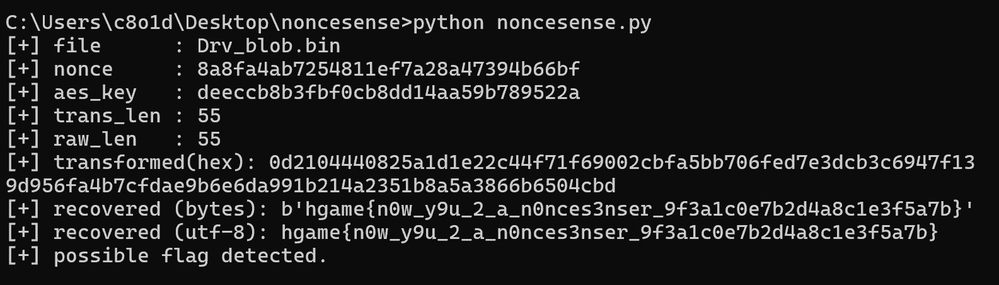

---

## week2

### Androuge

apktool + jadx

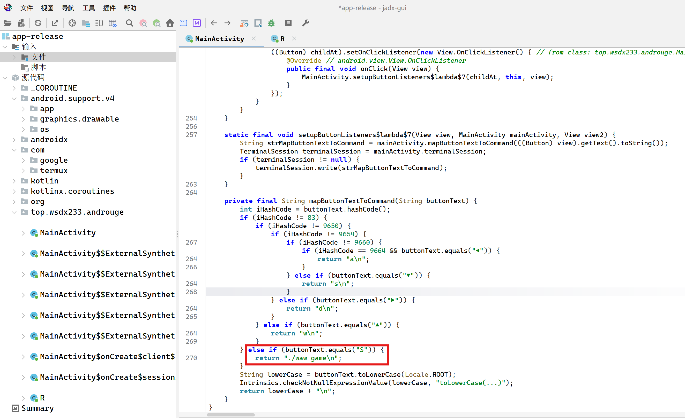

找按键交互

游戏本体在waw和game

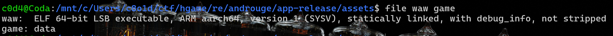

分别是程序和数据表

waw是ARM aarch64架构，no stripped

逆一下

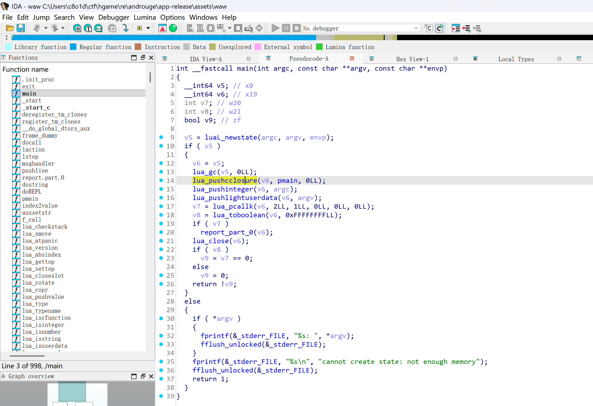

根据函数名，是一个lua语言编写的程序

找一下game数据表是在哪里载入的

> lua_load → luaD_protectedparser → f_parser → luaU_undump

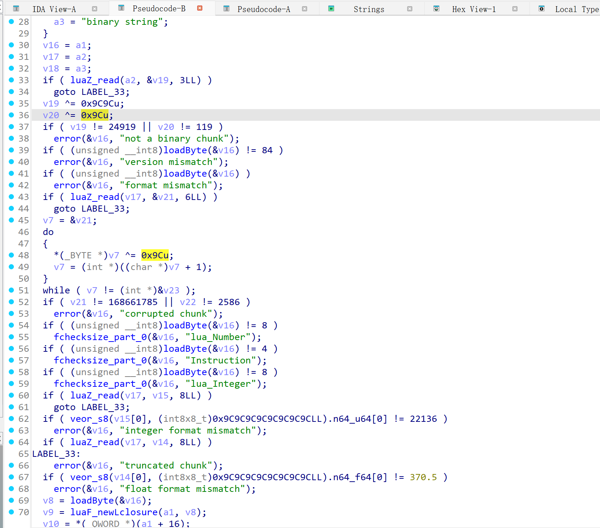

可以看到，是在对dump数据进行校验，每字节数据都xor`0x9C`

猜测game数据表不是明文，而是经过异或加密的密文，

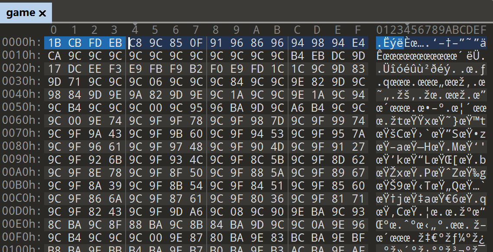

将前四字节除了第一字节还原后，刚好是`.Waw`

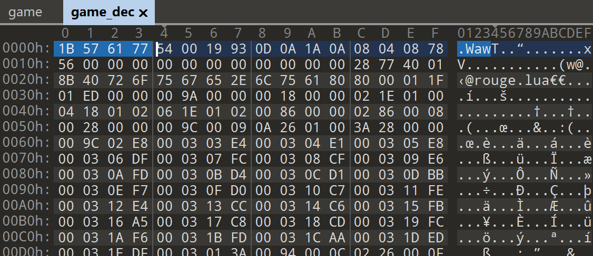

dump一下还原后的数据表，发现有不少游戏数据以及flag的信息

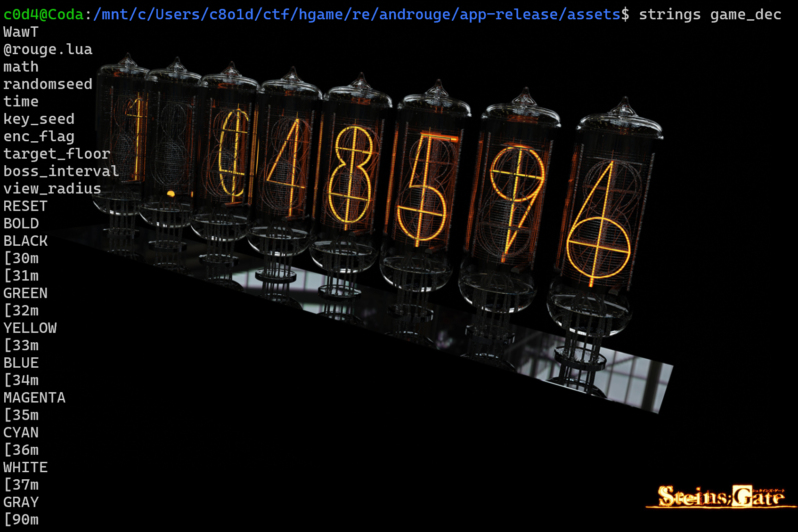

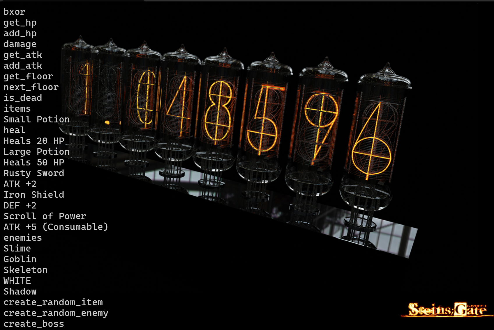

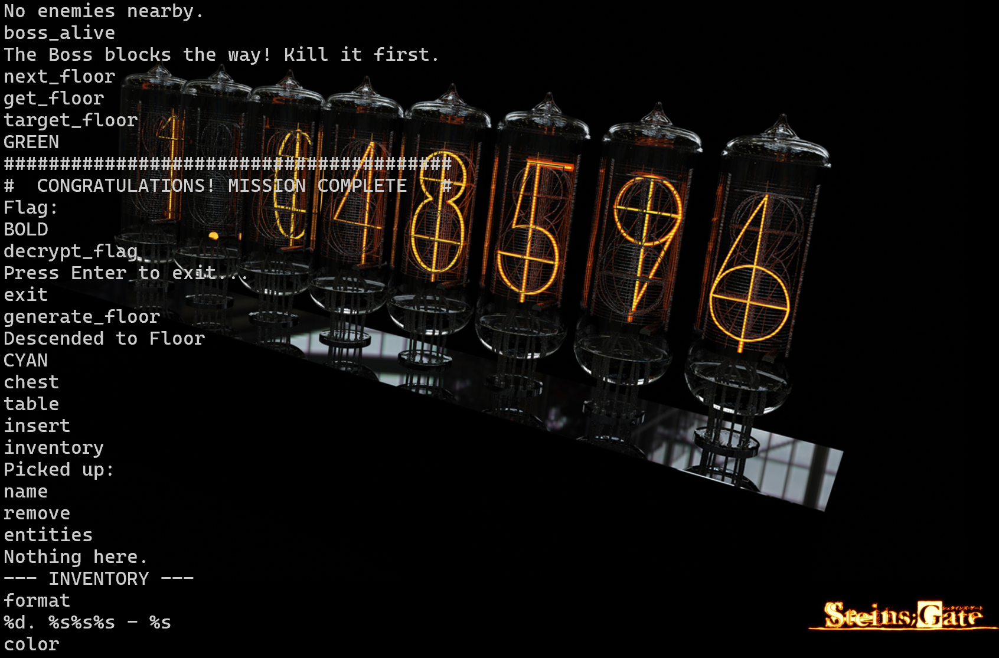

通过这些信息，大概能推断出获取flag的机制：

在游戏中到达target_floor，程序就会计算出flag并显示出来

我的思路是直接修改明文数据表，然后再加密回去，用patch后的数据表快速通关获得flag

在game_dec中检索对应游戏数值的字符串，修改数值

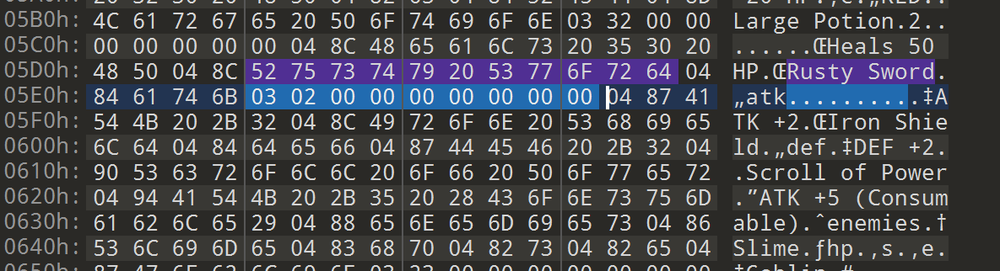

这里很容易就能发现数值段有一个`03 XX 00 00 00 00 00 00 00 04`的固定结构

> 我第一次尝试的时候直接把target_floor改成了1，结果flag是乱码，说明这个数据影响了flag生成，改为patch一些只优化游戏体验的数值

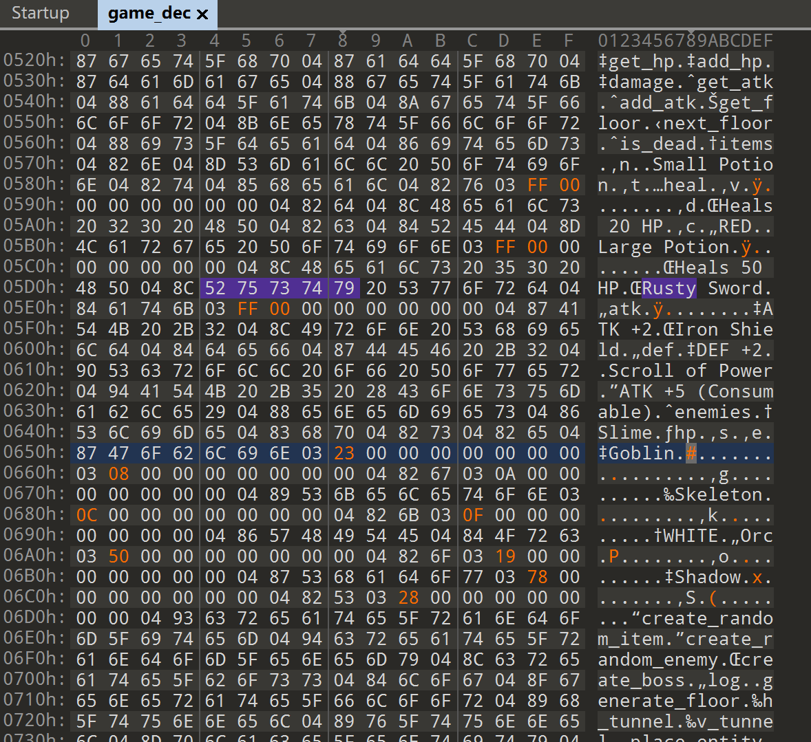

然后加密回去，在终端用qemu-aarch64跑`./waw game_patch`

花一点时间通关

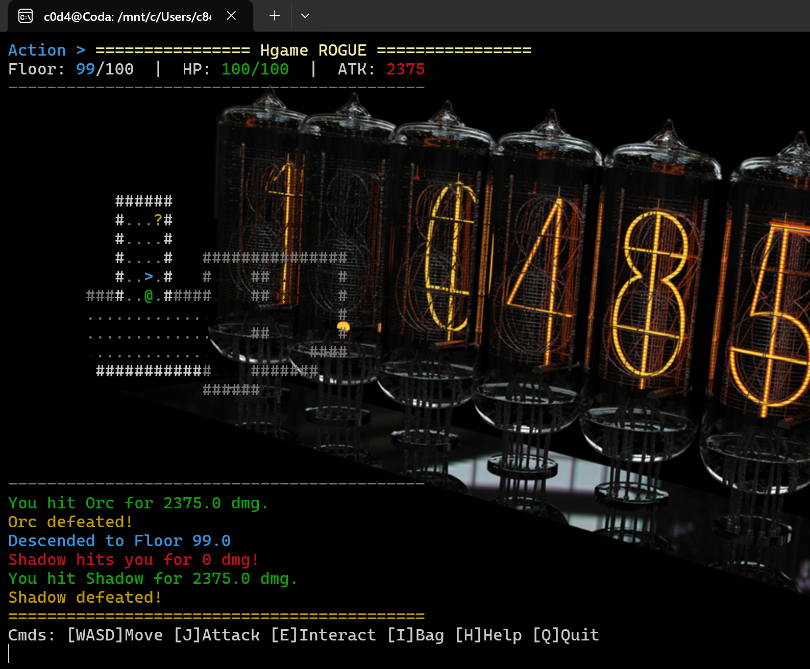

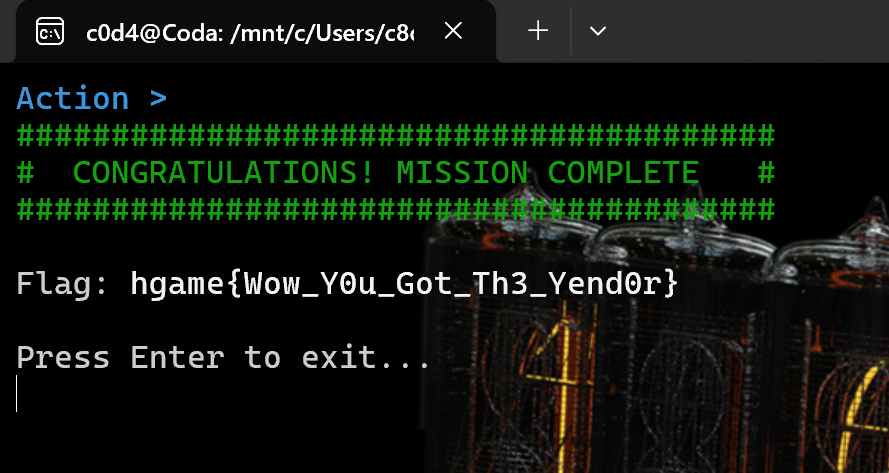

### Ouroboros

运行 jar

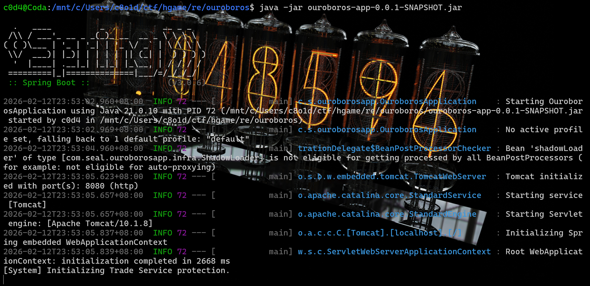

静态分析

**TradeService**

```java
package com.seal.ouroborosapp.domain;

import com.seal.ouroborosapi.RiskEngine;
import org.springframework.stereotype.Service;

@Service
/* loaded from: ouroboros-app-0.0.1-SNAPSHOT.jar:BOOT-INF/classes/com/seal/ouroborosapp/domain/TradeService.class */
public class TradeService {
    private RiskEngine riskEngine = new RiskPolicy();

    public String executeTrade(String token, double amount) {
        return this.riskEngine.check(token, amount);
    }
}
```

**RiskPolicy**

```java
package com.seal.ouroborosapp.domain;

import com.seal.ouroborosapi.RiskEngine;

/* loaded from: ouroboros-app-0.0.1-SNAPSHOT.jar:BOOT-INF/classes/com/seal/ouroborosapp/domain/RiskPolicy.class */
public class RiskPolicy implements RiskEngine {
    @Override // com.seal.ouroborosapi.RiskEngine
    public String check(String token, double amount) {
        return null;
    }
}
```

`return null`，显然不是最终逻辑

**ShadowLoader**

```java
public com.seal.ouroborosapi.RiskEngine initContext() throws java.lang.IllegalAccessException, java.lang.NoSuchMethodException, java.lang.ClassNotFoundException, java.lang.SecurityException, java.io.IOException, java.lang.IllegalArgumentException, java.lang.reflect.InvocationTargetException {
        /*
            Method dump skipped, instructions count: 830
            To view this dump change 'Code comments level' option to 'DEBUG'
        */
        throw new UnsupportedOperationException("Method not decompiled: com.seal.ouroborosapp.infra.ShadowLoader.initContext():com.seal.ouroborosapi.RiskEngine");
}
```

这里jadx挂了，直接解包用cfr反编译

```java
int k = IntegrityVerifier.getDeriveKey();
byte[] d = read("/application-data.db"); //R_NAME

long s = k & 0xffffffffL;
for i in [0..len-1]:
    s = (s * 1103515245 + 12345) & 0xffffffff
    x = (s >>> 16) & 0xff
    d[i] ^= x

payload = d[128:]
JarInputStream(payload) -> load classes
target class endsWith("RealRiskEngine")
```

而核心代码如上

隐藏了两个关键类：`RealRiskEngine`,`OuroborosVM`

所以“衔尾蛇”的含义就是

> 壳中壳 + 动态还原 + 自定义 VM

**RealRiskEngine**

```java
public class RealRiskEngine
implements RiskEngine {
    private static final byte[] LEGACY_STORE = new byte[]{-9, -17, -49, 7, 49, -50, -2, 54, 21, -65, -60, 107, 30, -42, 124, -83, 95, -100, -119, 108, 76, 62, -60, 14, -100, -19, -34, 63, -8, 6, -119, 1, -103, 17, 42, 82, -103, 23, 90, 73, -65, -85, 107, -22, 116, 115, 11, -41};
    private static final String LEGACY_KEY = "Ouroboros_Legacy";
    private static final String LEGACY_IV = "1234567812345678";

    public String check(String token, double amount) {
        if (this.checkLegacy(token)) {
            return "Legacy Access: Validated (But version expired).";
        }
        boolean isCorrect = OuroborosVM.execute(token, amount);
        if (isCorrect) {
            return "ACCESS GRANTED: Core Logic Validated.";
        }
        return null;
    }

    private boolean checkLegacy(String inputToken) {
        try {
            if (inputToken == null || inputToken.length() < 10) {
                return false;
            }
            IvParameterSpec iv = new IvParameterSpec(LEGACY_IV.getBytes(StandardCharsets.UTF_8));
            SecretKeySpec skeySpec = new SecretKeySpec(LEGACY_KEY.getBytes(StandardCharsets.UTF_8), "AES");
            Cipher cipher = Cipher.getInstance("AES/CBC/PKCS5PADDING");
            cipher.init(2, (Key)skeySpec, iv);
            byte[] original = cipher.doFinal(LEGACY_STORE);
            String decoyFlag = new String(original, StandardCharsets.UTF_8);
            return inputToken.equals(decoyFlag);
        }
        catch (Exception ex) {
            return false;
        }
    }
}
```

尝试AES-CBC解密，解密成功给出fake_flag

> flag{N0p3_Th1s_1s_A_D3c0y_G0_B4ck}

失败则走OuroborosVM

**OuroborosVM**

自定义VM，代码附带超长opcode和handlers，就不贴了

token(flag)存进`memory`

用`derive_key`dec`FIRMWARE`获得VM指令流校验token

已知opcode

- `0x10`：push immediate (16-bit)

- `0x20`：push token.length

- `0x30`：load memory[addr]

- `0x35`：xor

- `0x4A`：条件跳

- `0xFF`：结束并判断栈顶是否为 1

构造z3约束求解器

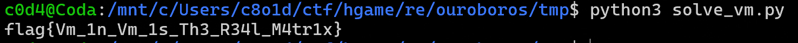

### Marionette

**main**

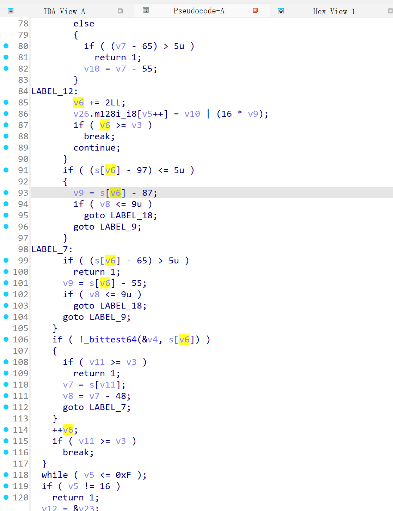

```c
v6 += 2LL;
v25.m128i_i8[v5++] = v10 | (16 * v9);
...
while ( v5 <= 0xF );
if ( v5 != 16 )
  return 1;
```

输入32个十六进制字符，每两个转成一字节存储，总共16B

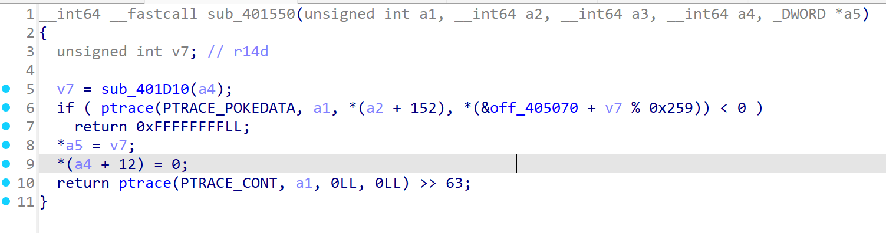

最后memcmp密文

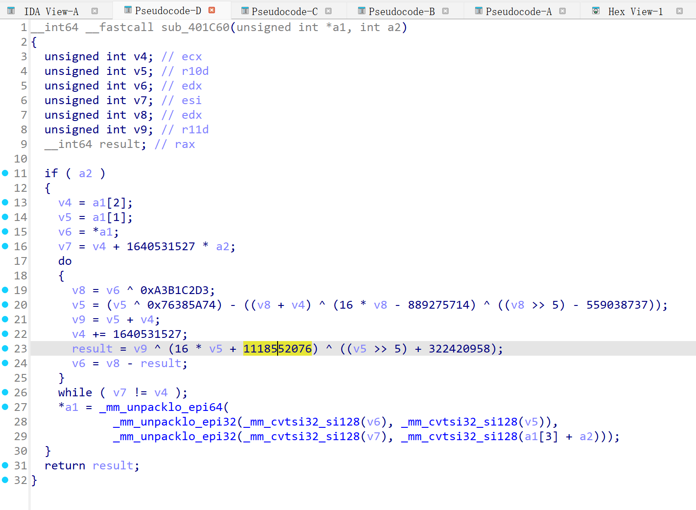

分析可知是 `fork + ptrace` 的木偶

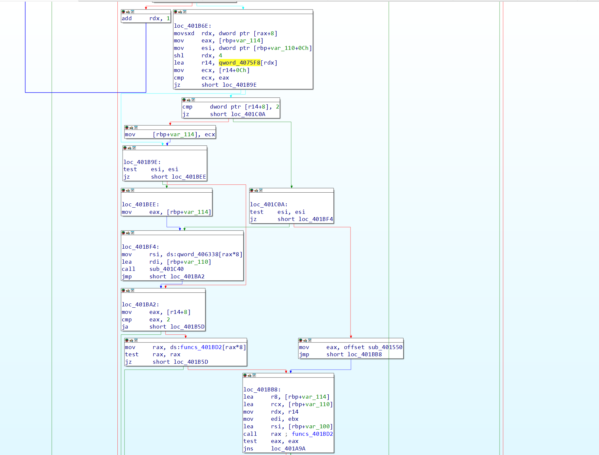

`sub_401D4E`被int3打断，不可读

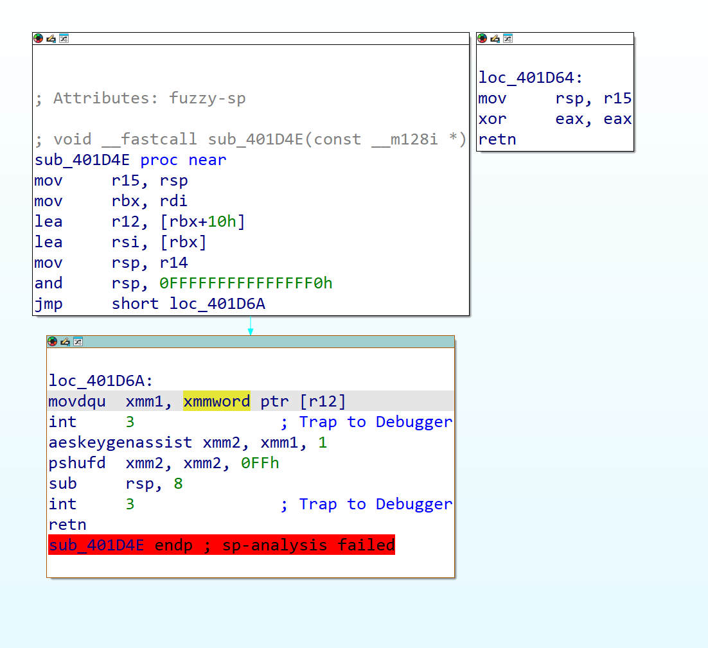

`xmm1`的值为硬编码`xmmword_405020`，用作`aeskeygenassist`

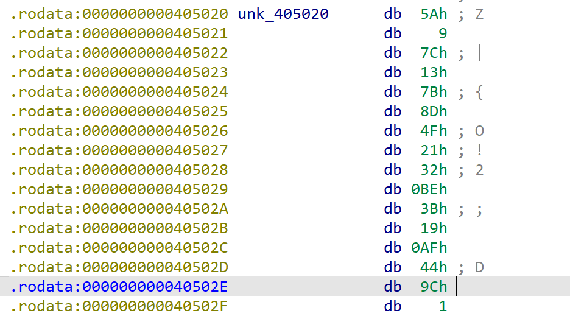

**trace_parent**

> 可以dump出off_405070，qword_406338，qword_4075F8，喂给ai纯静态还原状态机，但可操性更强的是动调

因为子进程会被父进程ptrace控制，所以需要detach child，单独调父进程

在gdb里直接实现记录idx，打印对应的汇编语块，最后输出idx状态序列

```
set pagination off
set confirm off
set disassemble-next-line off

set follow-fork-mode parent
set detach-on-fork on

handle SIGALRM nostop noprint pass
handle SIGPIPE nostop noprint pass

set logging file gdb_trace.log
set logging overwrite on
set logging enabled on

define pidxblk
    set $idx = (unsigned int)$edx
    set $tbl = (unsigned long long)0x405070
    set $tpl = *(unsigned long long*)($tbl + $idx*8)
    printf "[IDX] %u tpl=%#lx\n", $idx, $tpl
    x/6i $tpl
end

catch fork
commands
    silent
    continue
end

b *0x4015A6
commands
    silent
    pidxblk
    continue
end

run

set logging enabled off
shell awk '/^\[IDX\] /{print $2}' gdb_trace.log > idx_seq.txt

run
```

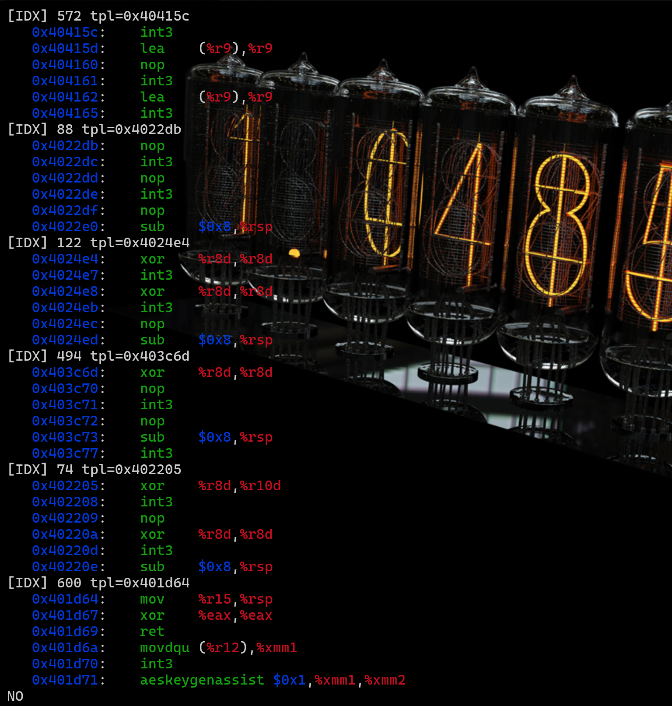

分析汇编，发现这600个block含有AES makekey/AES rounds/XOR/垃圾块，核心运算不是很多，按照状态序列求逆即可

```python
import re

target = bytes.fromhex("8cadb48febfd6fae8660ad44c3c75a31")
key0   = bytes.fromhex("5a097c137b8d4f2132be3b19af449c01")

S = [
0x63,0x7c,0x77,0x7b,0xf2,0x6b,0x6f,0xc5,0x30,0x01,0x67,0x2b,0xfe,0xd7,0xab,0x76,
0xca,0x82,0xc9,0x7d,0xfa,0x59,0x47,0xf0,0xad,0xd4,0xa2,0xaf,0x9c,0xa4,0x72,0xc0,
0xb7,0xfd,0x93,0x26,0x36,0x3f,0xf7,0xcc,0x34,0xa5,0xe5,0xf1,0x71,0xd8,0x31,0x15,
0x04,0xc7,0x23,0xc3,0x18,0x96,0x05,0x9a,0x07,0x12,0x80,0xe2,0xeb,0x27,0xb2,0x75,
0x09,0x83,0x2c,0x1a,0x1b,0x6e,0x5a,0xa0,0x52,0x3b,0xd6,0xb3,0x29,0xe3,0x2f,0x84,
0x53,0xd1,0x00,0xed,0x20,0xfc,0xb1,0x5b,0x6a,0xcb,0xbe,0x39,0x4a,0x4c,0x58,0xcf,
0xd0,0xef,0xaa,0xfb,0x43,0x4d,0x33,0x85,0x45,0xf9,0x02,0x7f,0x50,0x3c,0x9f,0xa8,
0x51,0xa3,0x40,0x8f,0x92,0x9d,0x38,0xf5,0xbc,0xb6,0xda,0x21,0x10,0xff,0xf3,0xd2,
0xcd,0x0c,0x13,0xec,0x5f,0x97,0x44,0x17,0xc4,0xa7,0x7e,0x3d,0x64,0x5d,0x19,0x73,
0x60,0x81,0x4f,0xdc,0x22,0x2a,0x90,0x88,0x46,0xee,0xb8,0x14,0xde,0x5e,0x0b,0xdb,
0xe0,0x32,0x3a,0x0a,0x49,0x06,0x24,0x5c,0xc2,0xd3,0xac,0x62,0x91,0x95,0xe4,0x79,
0xe7,0xc8,0x37,0x6d,0x8d,0xd5,0x4e,0xa9,0x6c,0x56,0xf4,0xea,0x65,0x7a,0xae,0x08,
0xba,0x78,0x25,0x2e,0x1c,0xa6,0xb4,0xc6,0xe8,0xdd,0x74,0x1f,0x4b,0xbd,0x8b,0x8a,
0x70,0x3e,0xb5,0x66,0x48,0x03,0xf6,0x0e,0x61,0x35,0x57,0xb9,0x86,0xc1,0x1d,0x9e,
0xe1,0xf8,0x98,0x11,0x69,0xd9,0x8e,0x94,0x9b,0x1e,0x87,0xe9,0xce,0x55,0x28,0xdf,
0x8c,0xa1,0x89,0x0d,0xbf,0xe6,0x42,0x68,0x41,0x99,0x2d,0x0f,0xb0,0x54,0xbb,0x16
]
IS = [0]*256
for i,v in enumerate(S): IS[v]=i

def xtime(x):
    x <<= 1
    if x & 0x100: x ^= 0x11B
    return x & 0xff

def mul(a,b):
    r = 0
    while b:
        if b & 1: r ^= a
        a = xtime(a)
        b >>= 1
    return r

def rotw(w): return w[1:]+w[:1]
def subw(w): return bytes(S[x] for x in w)
def xorb(a,b): return bytes(x^y for x,y in zip(a,b))

def expand_key(k, rounds):
    ws = [k[i:i+4] for i in range(0,16,4)]
    rcon = 1
    while len(ws) < 4*(rounds+1):
        t = ws[-1]
        if len(ws) % 4 == 0:
            t = xorb(subw(rotw(t)), bytes([rcon,0,0,0]))
            rcon = xtime(rcon)
        ws.append(xorb(ws[-4], t))
    return [b''.join(ws[i*4:(i+1)*4]) for i in range(rounds+1)]

def b2s(b): return [[b[c*4+r] for c in range(4)] for r in range(4)]
def s2b(s): return bytes(s[r][c] for c in range(4) for r in range(4))

def addk(s, rk):
    k = b2s(rk)
    for r in range(4):
        for c in range(4):
            s[r][c] ^= k[r][c]

def inv_sub(s):
    for r in range(4):
        for c in range(4):
            s[r][c] = IS[s[r][c]]

def inv_shift(s):
    for r in range(1,4):
        s[r] = s[r][-r:] + s[r][:-r]

def inv_mix(s):
    for c in range(4):
        a = [s[r][c] for r in range(4)]
        s[0][c] = mul(a[0],14)^mul(a[1],11)^mul(a[2],13)^mul(a[3],9)
        s[1][c] = mul(a[0],9)^mul(a[1],14)^mul(a[2],11)^mul(a[3],13)
        s[2][c] = mul(a[0],13)^mul(a[1],9)^mul(a[2],14)^mul(a[3],11)
        s[3][c] = mul(a[0],11)^mul(a[1],13)^mul(a[2],9)^mul(a[3],14)

def dec_custom(ct, key, rounds):
    rks = expand_key(key, rounds)
    s = b2s(ct)
    addk(s, rks[rounds]); inv_shift(s); inv_sub(s)
    for r in range(rounds-1,0,-1):
        addk(s, rks[r]); inv_mix(s); inv_shift(s); inv_sub(s)
    addk(s, rks[0])
    return s2b(s)

idx = [int(x) for x in re.findall(r'\d+', open('idx_seq.txt').read())]
txt = open('gdb_trace.log').read()

sec = {int(i):b for i,b in re.findall(r'(?ms)^\[IDX\]\s+(\d+)\s*\n(.*?)(?=^\[IDX\]\s+\d+\s*\n|\Z)', txt)}
body = ''.join(sec.get(i,'') for i in idx) if sec else txt

rounds = body.count('aesenc ') + body.count('aesenclast ') or 12
mid = bytearray(dec_custom(target, key0, rounds))

if 'xor' in body and any(x in body for x in ('%al','%cl','%dl')):
    for i in range(1,16):
        mid[i] ^= mid[i-1]

print(mid.hex())
```

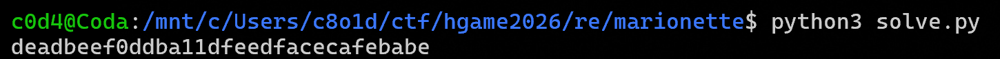
