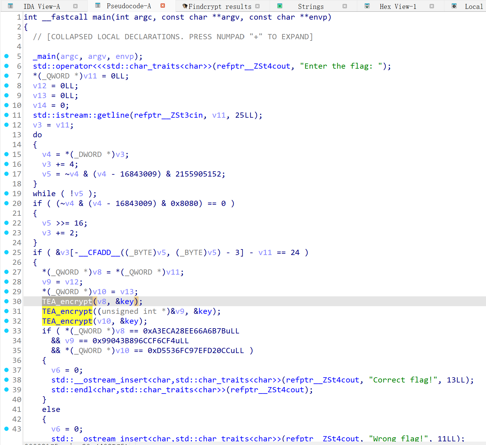
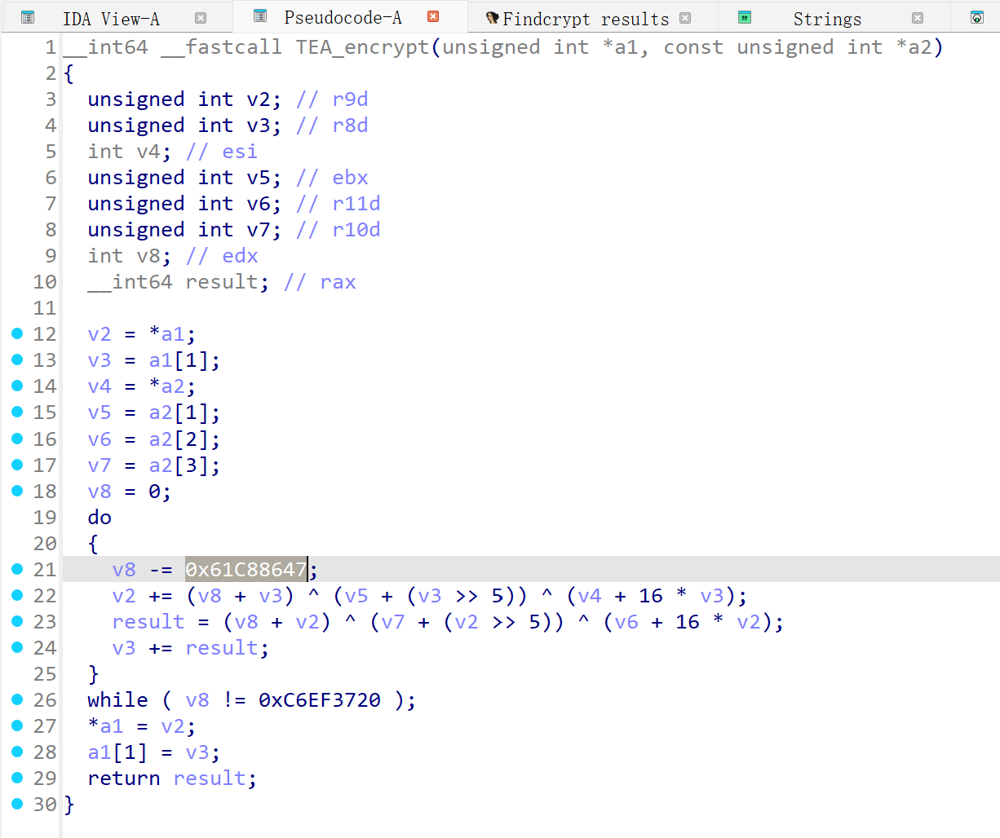
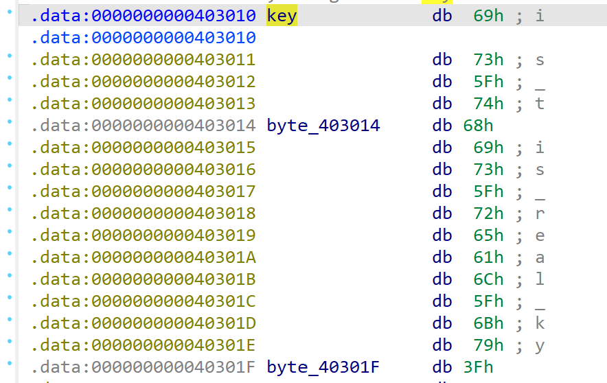
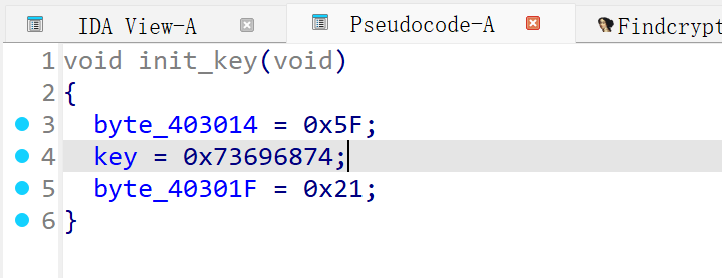
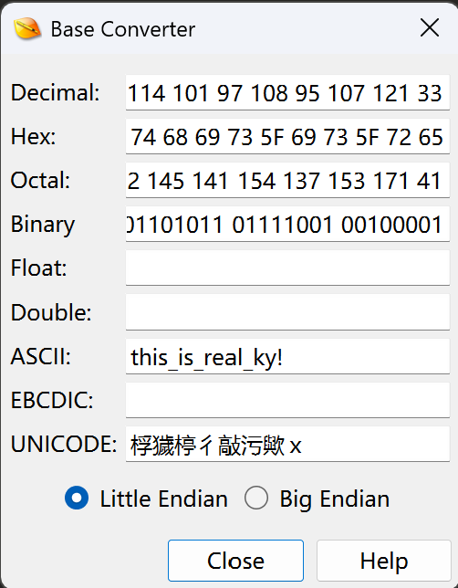
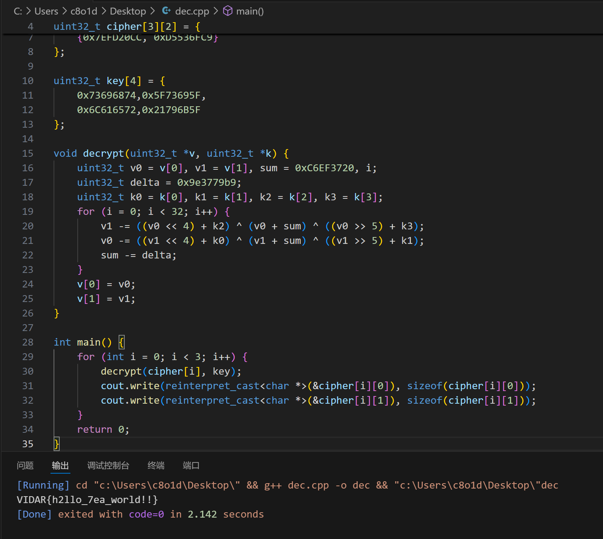

# simple_tea

> <https://hgame.vidar.club/games/8/challenges?challenge=171>

<!-- more -->

先分析pseudocode，

发现有tea_encrypt函数，知道这里有tea加密，~~其实也可以用findcrypt插件，但这里没必要~~

> do-while这段循环事实上是用来约束用户输入字符串长度的，
> 依据v8，v9，v10的检验，可以看出plain长度为3*8=24字节，

tea_encrypt的三次调用说明程序是将用户24字节输入拆成3段qword分段加密，

点进加密函数看一下，

可以发现是标准TEA

那么接下来只需要获取key，编写dec即可

点开key看看


这似乎不是真正的key
（当然这是基于猜测，也可以去验证一下）

这时候看看有没有什么隐藏的初始化函数，改变key的硬编码的

发现在main上方有一个init_key，
点开看看，

> 建议多按按H将decimal全部转成hex，有时候会下意识搞混

显然，key的硬编码在加密前被改成了
`74 68 69 73 5F 69 73 5F 72 65 61 6C 5F 6B 79 21`

**《疑问句改肯定句》**


这样就获得了正确的key，dec如下
```c
#include <bits/stdc++.h>
using namespace std;

uint32_t cipher[3][2] = {
    {0xE66A6B7B, 0xA3ECA28E},
    {0x6CCF6CF4, 0x99043B89},
    {0x7EFD20CC, 0xD5536FC9}
};

uint32_t key[4] = {
    0x73696874,0x5F73695F,
    0x6C616572,0x21796B5F
};

void decrypt(uint32_t *v, uint32_t *k) {
    uint32_t v0 = v[0], v1 = v[1], sum = 0xC6EF3720, i;
    uint32_t delta = 0x9e3779b9;
    uint32_t k0 = k[0], k1 = k[1], k2 = k[2], k3 = k[3];
    for (i = 0; i < 32; i++) {
        v1 -= ((v0 << 4) + k2) ^ (v0 + sum) ^ ((v0 >> 5) + k3);
        v0 -= ((v1 << 4) + k0) ^ (v1 + sum) ^ ((v1 >> 5) + k1);
        sum -= delta;
    }
    v[0] = v0;
    v[1] = v1;
}

int main() {
    for (int i = 0; i < 3; i++) {
        decrypt(cipher[i], key);
        cout.write(reinterpret_cast<char *>(&cipher[i][0]), sizeof(cipher[i][0]));
        cout.write(reinterpret_cast<char *>(&cipher[i][1]), sizeof(cipher[i][1]));
    }
    return 0;
}
```


