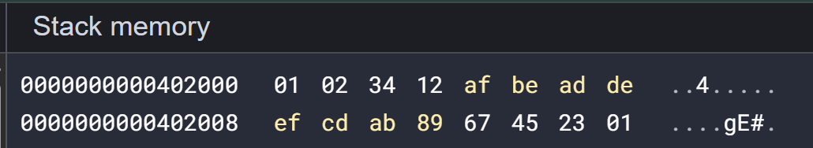
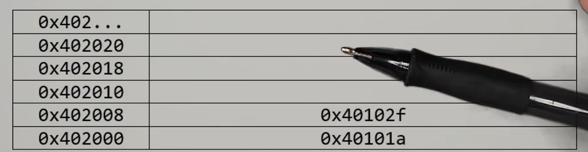
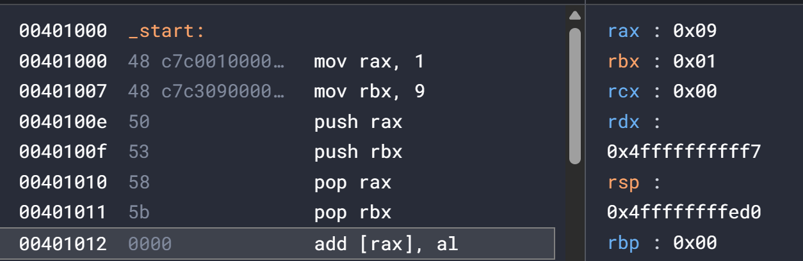
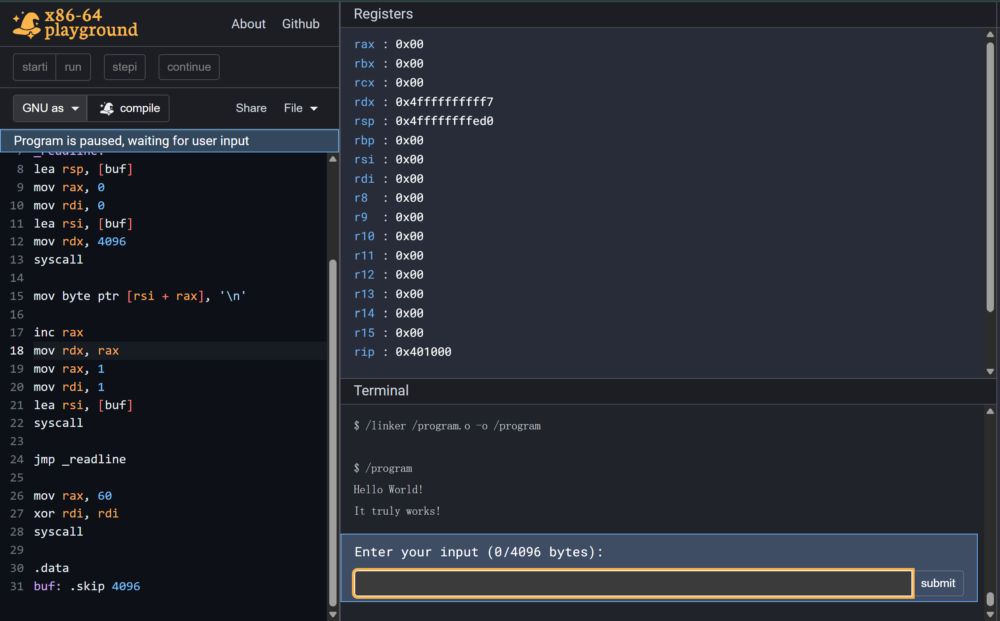
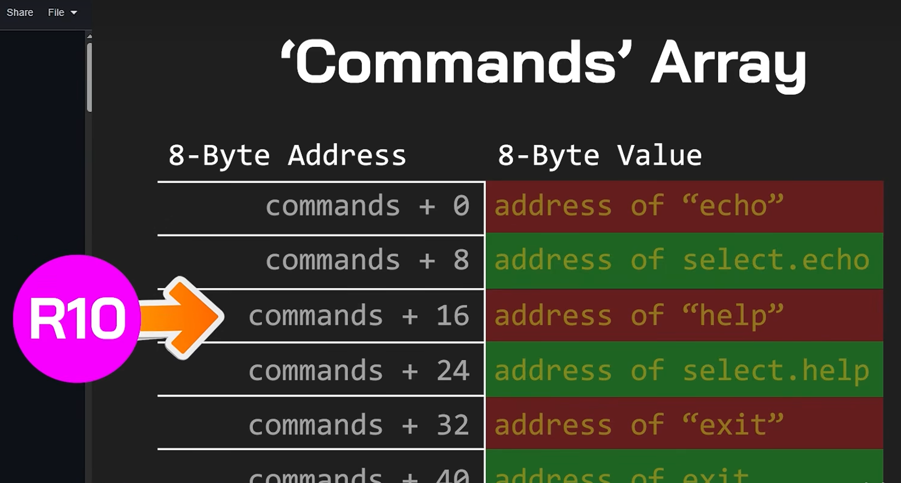
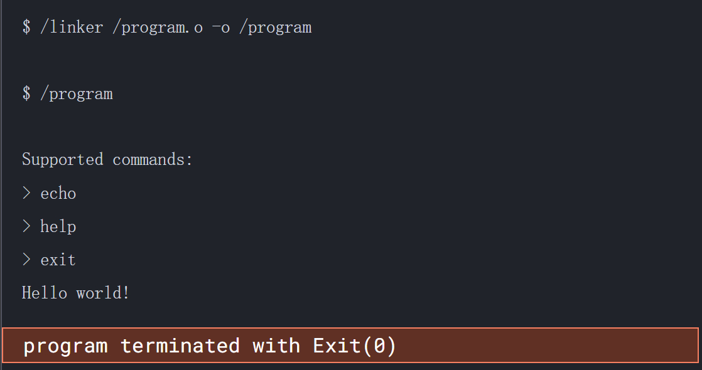

# x86-64 ASM

> [Assembly Tutorial x86-64 Architecture](https://www.youtube.com/watch?v=PxiMLtsuGO0&list=PL9o2C-4xGfjHl5PF-Xt-yWH2zc4wjJ3AW) , [练习平台](https://app.x64.halb.it/)

## 基础指令语法

**register**
rax, rbx, rcx, rdx - al, ah, ax, eax, rax
rsp - stack pointer
rbp - base pointer
rsi, rdi
r10, r9, r8
r11, r12, r13, r14, r15
rip - instruction pointer

**mov**
```asm
mov rax, 5
mov rbx, rax
mov rcx, 0x1234
mov rdx, [0x401000]
```

**add, sub, inc, dec**
```asm
add rax, 5
sub rbx, 3
inc rcx
dec rdx
```

**RAM**

lea ( load effective address )

```asm
.text

_start:

lea rsp, [mem]

.data

mem:

.byte 0x00, 0x01, 0x02
.word 0x1234
.long 0xdeadbeaf
.quad 0x0123456789abcdef
```


**syscall**

系统调用号通过 rax 传递，参数依次通过 rdi, rsi, rdx, r10, r8, r9 传递。


print "Hello World!"
```asm
.intel_syntax noprefix
.global _start
.text

_start:
mov rax, 1
mov rdi, 1
lea rsi, [str]
lea rdx, [strlen]

syscall

mov rax, 60
xor rdi, rdi
syscall

.data

str: .ascii "Hello World!"
strlen = . - str
```

[linux-syscall-table](https://filippo.io/linux-syscall-table/)

**jmp**

```asm
jmp 0xdeadbeaf
jmp print_hello
```
**call stack**

用于保存函数调用链的地址，`call` 指令包含了此功能


**ret**

因为 `call` 隐含了  `push rip` ，`ret` 隐含了 `pop rip`，
所以一个 `call` 对应一个 `ret` （除了 `_exit` ）

**condition/loop**
```asm
# Signed
jg - jump if greater
jge - jump if greater or equal to
jl - jump if less than
jle - jump if less than or equal to

# Unsigned
ja - jump if above (greater)
jae - jump if above or equal to
jb - jump if below (less)
jbe - jump if below or equal to

je - jump if equal
jz - jump if zero
jne - jump if not equal
jnz - jump if not zero
```

if语句实例
```c
if (rax == 3) {
    printf("rax is 3!");
}
return 0;
```

```asm
.intel_syntax noprefix
.global _start
.text

_start:

mov rax, 3
cmp rax, 3
jne exit

print:
 mov rax, 1
 mov rdi, 1
 lea rsi, [str]
 lea rdx, [strlen]
 syscall

exit: 
 mov rax, 60
 xor rdi, rdi
 syscall

.data

str: .ascii "rax is 3!"
strlen = . - str
```

for/while语句实例
```c
for (int i = 0; i < 10; i++) {
    ...
}
return 0;
```

```asm
.intel_syntax noprefix
.global _start
.text

_start:

mov rax, 0

loop:
 cmp rax, 10
 jge exit
 inc rax
 jmp loop

exit:
 mov rax, 60
 xor rdi, rdi
 syscall
```

int3 - interrupt 3 中断

**push/pop**

push将register压入栈顶，pop则从栈顶弹出到指定register

交换两个寄存器中的值
```asm
mov rax, 1
mov rbx, 9
push rax
push rbx
pop rax
pop rbx
```


**mul/imul/div/idiv**

`mul/div` 只接受两个寄存器之间的运算，不能操作及时数, 不能操作负数，`rax` 为隐式的算式第一位
> rax 是 积/商 的寄存器
> rdx 是 余数 的寄存器 **以及** 被除数的高64bit，运算除法前需清空

```asm
mov rax, 5
mov rbx, 3
mul rbx

;# rax 0x0f
```

```asm
xor rdx, rdx
mov rax, 6
mov rbx, 4
div rbx

;# rax 0x01
;# rdx 0x02
```

`imul/idiv` 的用法更接近 `add/sub` ，且能处理有符号数, 即时数

```asm
imul rax, rbx
imul rax, -7

xor rdx, rdx
idiv rax, rbx
```

## 综合运用

**动态打印多个字符串**
```asm
.intel_syntax noprefix
.global _start
.text

_start:
lea rdi, [s1]
call _print

lea rdi, [s2]
call _print

_exit:
 mov rax, 60
 xor rdi, rdi
 syscall

_print:
 push rdi
 call _strlen
 pop rdi

 mov rdx, rax
 mov rsi, rdi
 mov rax, 1
 mov rdi, 1
 syscall
 ret

_strlen:
 mov rax, rdi
 xor rcx, rcx
loop:
 mov bl, [rax]
 cmp bl, 0
 je _strlen_exit
 inc rax
 inc rcx
 jmp loop
_strlen_exit:
 int3
 xor rdi, rdi
 mov rax, rcx
 ret

.data
s1: .asciz "Hello World!\n"
s2: .asciz "Oh! Senbai, Ciallos~"
```

整数转字符串（数位分离）
```c
#include <bits/stdc++.h>

int main() {
    int a = 123;
    char buf[10000];
    int len = 0;
    while (a) {
        buf[len++] = a % 10 + '0';
        a /= 10;
    }
    for (int i = len - 1; i >= 0; i--) {
        printf("%c", buf[i]);
    }
    return 0;
}
```

```asm
.intel_syntax noprefix
.global _start
.text

_start:
mov rdi, 123
call _itoa

mov rdi, rax
call _print
call _exit

_itoa:
 mov rbx, 10
 mov rax, rdi
 lea rdi, [buf + 32]
 mov byte ptr [rdi], 0

_itoa_loop:
 xor rdx, rdx
 dec rdi
 div rbx
 add rdx, '0'
 mov [rdi], dl
 cmp rax, 0
 jne _itoa_loop
 mov rax, rdi
 ret

_print:
 push rdi
 call _strlen
 pop rsi
 mov rdx, rax
 mov rax, 1
 mov rdi, 1
 syscall
 ret

_exit:
 mov rax, 60
 xor rdi, rdi
 syscall

_strlen:
 push rbp
 mov rbp, rsp
 xor rcx, rcx
 _strlen_loop:
 mov al, [rdi]
 cmp al, 0x0
 je _strlen_end
 inc rcx
 inc rdi
 jmp _strlen_loop
 _strlen_end:
 mov rax, rcx
 mov rsp, rbp
 pop rbp
 ret

.data
buf: .skip 1024
```

**read/write**

`read(0, 0, addr, buf_len)` ， 实际长度存储在 `rax`

```asm
mov rax, 0
mov rdi, 0
lea rsi, [buf]
mov rdx, 4096 ;# 预留空间
syscall
```

`write(1, 1, addr, len)`
```asm
mov rdx, rax ;# 先把实际长度弄过来
mov rax, 1
mov rdi, 1
lea rsi, [buf]
syscall
```

无限循环输入并立刻输出
```asm
.intel_syntax noprefix
.global _start
.text

_start:

_readline:
 mov rax, 0
 mov rdi, 0
 lea rsi, [buf]
 mov rdx, 4096
 syscall

mov byte ptr [rsi + rax], '\n'

inc rax
mov rdx, rax
mov rax, 1
mov rdi, 1
lea rsi, [buf]
syscall

jmp _readline

mov rax, 60
xor rdi, rdi
syscall

.data
buf: .skip 4096
```



**实现一个简易shell**（包含echo, help, exit）

```asm
.intel_syntax noprefix
.global _start
.text

_start:

lea rdi, [buf]
lea rsi, [bufsize]
call readline
cmp rax, 0
je _start

lea rdi, [buf]
lea rsi, [tokens]
call tokenize

lea r10, [commands]
cmd_loop:
 mov rax, [r10]
 cmp rax, 0
 je cmd_notfound
 
 mov rdi, [tokens]
 mov rsi, rax
 call strcmp

 cmp rax, 0
 je cmd_found
 
 add r10, 16
 jmp cmd_loop

cmd_found:
 add r10, 8
 mov rax, [r10]
 jmp rax

cmd_notfound:
 lea rdi, [s_nocmd]
 call print

jmp _start

select_help:
 call help
 jmp _start

select_echo:
 lea rdi, [tokens + 8]
 
 call echo
 jmp _start

help:
 lea rdi, [s_help]
 call print
 ret

echo:
 mov r15, rdi
 
 echo_loop:
  mov rdi, [r15]
  cmp rdi, 0
  je echo_ret
  call print
  
  lea rdi, [space]
  call print
  
  add r15, 8
  jmp echo_loop
  
  echo_ret:
   lea rdi, [newline]
   call print
   ret

strcmp: ;# args: rdi s1, rsi, s2
 xor rax, rax
 mov al, [rdi]
 mov dl, [rsi]
 cmp al, dl
 jne sc_done
 cmp al, 0
 je sc_done

 inc rdi
 inc rsi
 jmp strcmp

 sc_done:
  sub al, dl 
  ret

tokenize:
 mov r15, rsi
 
 tokenize_loop:
  call skipwhite
  cmp byte ptr [rdi], 0x0
  je tokenize_end
  
  mov [r15], rdi
  add r15, 8
  call findend
  cmp byte ptr [rdi], 0
  je tokenize_end
  
  mov byte ptr [rdi], 0
  inc rdi
  jmp tokenize_loop
  
  tokenize_end:
   mov qword ptr [r15], 0
   ret

findend:
 cmp byte ptr [rdi], ' '
 je findend_ret
 
 cmp byte ptr [rdi], 0
 je findend_ret

 inc rdi
 jmp findend

 findend_ret:
  ret
  
skipwhite:
 cmp byte ptr [rdi], ' '
 je skipwhite_advance

 ret

 skipwhite_advance:
  inc rdi
  jmp skipwhite

readline:
 lea rdx, [rsi - 1]
 mov rsi, rdi
 mov rax, 0
 mov rdi, 0
 syscall

 mov byte ptr [rsi + rax], 0
 ret

print: ;# args: rdi item addr
 push rdi
 call slen
 mov rdx, rax
 pop rsi
 mov rax, 1
 mov rdi, 1
 syscall
 ret

slen:
 xor rcx, rcx

 slen_loop:
  mov al, [rdi + rcx]
  cmp al, 0
  je slen_ret
  inc rcx
  jmp slen_loop
  
 slen_ret:
  mov rax, rcx
  ret

_exit:
 mov rax, 60
 xor rdi, rdi
 syscall

.data
buf: .skip 128, 0xaa
bufsize = . - buf
tokens: .skip 128, 0xbb
newline: .asciz "\n"
space: .asciz " "
s_nocmd: .asciz "\nUnsupported command!\n"
s_cmd_exit: .asciz "exit"
s_cmd_echo: .asciz "echo"
s_cmd_help: .asciz "help"
s_help: .asciz "\nSupported commands:\n> echo\n> help\n> exit\n"
commands: ;# function ptr
 .quad s_cmd_exit, _exit
 .quad s_cmd_echo, select_echo
 .quad s_cmd_help, select_help
```

匹配命令使用的是函数指针 + strcmp




*写出来是真的长啊……还只是这么简单的功能 QwQ*

## 堆栈

栈和堆共用一块空间，向彼此延申

栈从高地址到低地址， 堆从低地址到高地址

因此， 所谓的“栈顶”位于栈的最低地址， 也就是视觉上的最上方


rsp 会即时指向栈顶

rbp 则始终指向栈顶的初始位置（base）

## allocator

**malloc**

> **m**emory **alloc**ate

从 heap 中申请一块内存，并返回地址

最简单的实现是维护一个 `heap pointer`：

```text
[ used ][ used ][ free... ]
                ↑
            heap pointer
```

**alignment**

> memory alignment 内存对齐
> 
内存通常需要按 8/16 bytes 对齐：
malloc(5)  -> 8 bytes
malloc(9)  -> 16 bytes

**block header**
为了支持 free()，每块内存前保存一些信息：
[ size | used ][ user data ]

malloc() 返回的是 user data 的地址

**free**
free(ptr) 不会清空内存，只是把对应块标记为：
used -> free

之后新的 malloc() 可以重新利用这块空间。

**基本流程**

```text
malloc:
    找 free block
        → 有就复用
        → 没有就从 heap 后面继续分配
        → 空间不够就扩展 heap
    修改 user data
    返回 heap pointer

free:
    找到 block header
        → used = 0
```