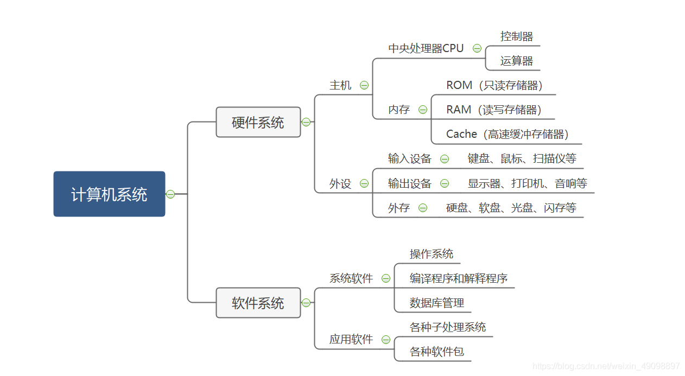

> 翻蓝书整理出来的知识点，草率且不严谨，仅供参考
<!-- more -->

 

## 计算机常识

+ 电子管——>晶体管——>集成电路——>超大规模集成电路

+ 1946 美国宾夕法尼亚大学第一台电子计算机 ENIAC

+ 冯·诺依曼核心理论
  
  + 二进制
  
  + 存储程序
  
  + 五大部件 (I/O，运算器ALU，存储器，控制器)

+ 图灵 英国人

 

----

 

## 计算机系统

 

 

### 硬件系统

 

速度：Cache > 内存 > 外存

 

### 软件系统

 

操作系统

+ 桌面OS
  
  + 类UNIX
  
  + Windows

+ 服务器OS
  
  + UNIX
  
  + Windows
  
  + Linux

 

----

 

## 计算机语言

> 计算机指令： 操作码 & 操作数

 

+ 机器语言

+ 汇编语言

+ 高级语言
  
  + 编译性  C/C++  Pascal
  
  + 解释性  PHP  Java  JavaScript  Python  Ruby

 

+ 面向对象
  
  + 纯面向对象  Smalltalk
  
  + 混合型  C++

+ 面向过程  C

 

----

 

## 计算机网络

 

**局域网 (LAN)**      **城域网 (MAN)**      **广域网 (WAN)**

 

### Internet

> Internet采用的协议为TCP/IP，即 传输控制协议(Transmission Control Protocol，TCP) 与 网络协议(Internet Protocol，IP)

 

OSI协议**7**层    TCP/IP协议**4**层

 

#### TCP/IP

+ 应用层    Telnet (远程登录)  FTP (文本传输)   E-mail

+ 传输层    TCP  UDP

+ 网络层    IP

+ 接口层

 

#### IP地址

> 识别Internet上节点的地址，IPV4为32位(4组\*8位)，IPV6位128位(8组\*16位)

 

IPV4    4个不大于255的数组成

+ A类地址： 1~126

+ B类地址：128~191

+ C类地址： 192~223

*回环地址： 127.0.0.1*

 

#### 域名

> 字符形式的IP地址 (避免记忆4个无意义数)

 

格式：    开头.主机名.主机类别.国家名 *(可不要)*

eg.  域名：oj.ac-code.com

       对应 IP：    121.40.233.101

 

域名由域名系统 (Domain Name System，DNS) 管理

 

#### 电子邮件

 

+ SMTP  发邮件

+ MIME

+ POP3  收邮件
