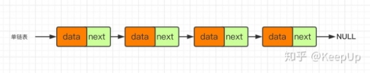
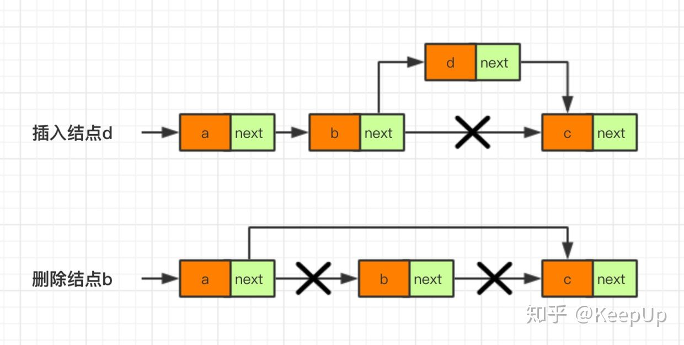
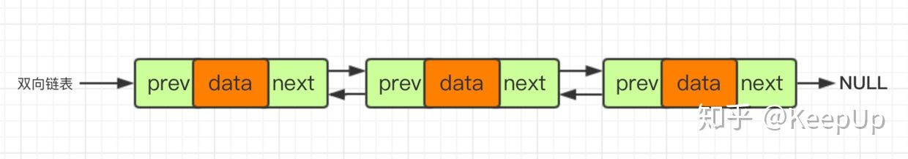
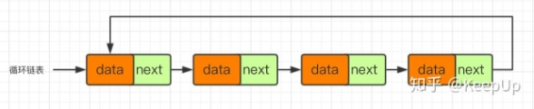

> 当需要插入或删除数据结构中某些元素时，用链表比数组方便得多，访问某一元素时则链表就是个dd。   ~~(链表可以用来秀指针操作~~

注意：链表中的每个元素在使用前都要申请一个空间（new）并指向NULL(->next = NULL)，即初始化操作
由于链表不能访问某一元素，所以每次操作前都要从头开始（p =head），并用j记录节点下标
<!-- more -->

----

## 单链表基本框架



### 结构体

```c
struct Node {                 
	int data;
	Node *next;   //自引用，构建链表，链表中每个结点有两部分，数据域data和指针域next，data存值，next指向下一个结点
} *head, *p, *r;	       //头指针，指针，尾指针
```

### 建表

```c
void set(int a[], int n) {  //尾插 
	head = new Node; head -> next = NULL; r=head;    //刚开始是r和head是在一起的，便于尾插操作
	for (int i = 1; i <= n; i++) {
		p = new Node;
		p -> data = a[i];
		p -> next = NULL;
		r -> next = p;         //将p插到r后面
		r = p;                      //r后移
	}
}
```





### 插入

```c
void insert(int a[], int pos, int val) {    //详见模拟图
	p = head;		      //从头开始
	int i = 0;
	while (p != NULL && i < pos - 1) {
		p = p -> next;      //p指向下一个结点
		i++;
	}
	Node *s; 
	s = new Node;
	s -> data = val;
	s -> next = p -> next;
	p -> next = s; 
}
```

### 删除

```c
void del(int a[], int pos) {      //详见模拟图
	p = head;
	int i = 0;
	while (p != NULL && i < pos - 1) {
		p = p -> next;
		i++;
	}
	Node *s;
	s = new Node;
	s = p -> next;
	p -> next = s -> next;
	delete[] s;
} 
```

### 打印

```c
void print() {                                      
	p = head -> next;
	while (p -> next != NULL) {
		cout << p -> data << " ";
		p = p -> next;
	}
	cout << p -> data << endl;
}
```

### 主函数

```c
int main() {
	int n;
	cin >> n;
	int a[200000];
	for (int i = 1; i <= n; i++) {
		cin >> a[i];
	}
	set(a, n); 
	int m;
	cin >> m;
	for (int i = 1; i <= n; i++) {
		if (a[i] == m) {
			del(a, i);
		}
	}
	print();
	delete[] p;     //防内存泄漏
  	delete[] head;
	return 0;
} 
```

----

## 双向链表模拟



----

## 循环链表模拟


